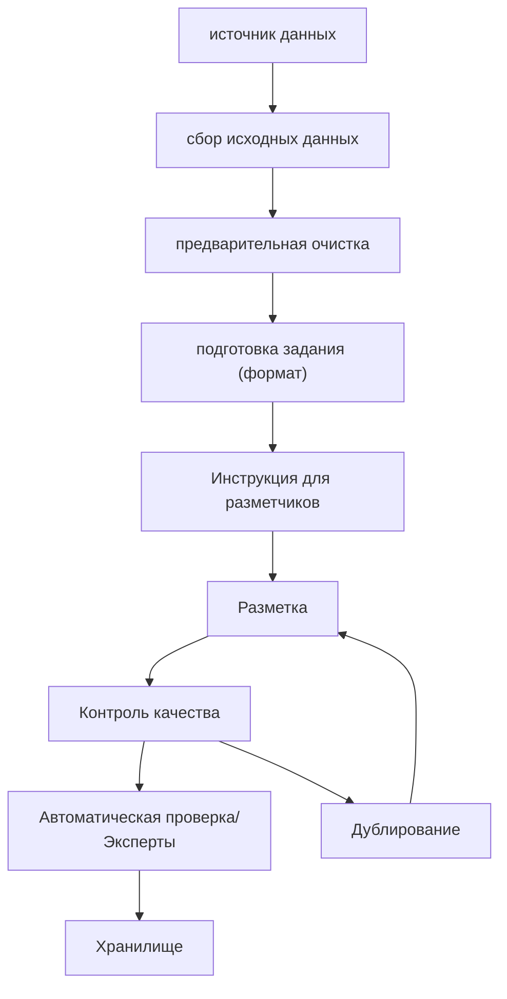

```mermaid
flowchart TD
    A["источник данных"] --> B["сбор исходных данных"]
    B --> C["предварительная очистка"]
    C --> D["подготовка задания (формат)"]
    D --> E["Инструкция для разметчиков"]
    E --> F["Разметка"]
    F --> G["Контроль качества"]
    G --> H["Автоматическая проверка/Эксперты"]
    H --> I["Хранилище"]

    J["Дублирование"] --> F
    G --> J
```

### Источники:
- сайты
- соц. сети
- каналы (текст, подкасты, видео)
- CRM, 