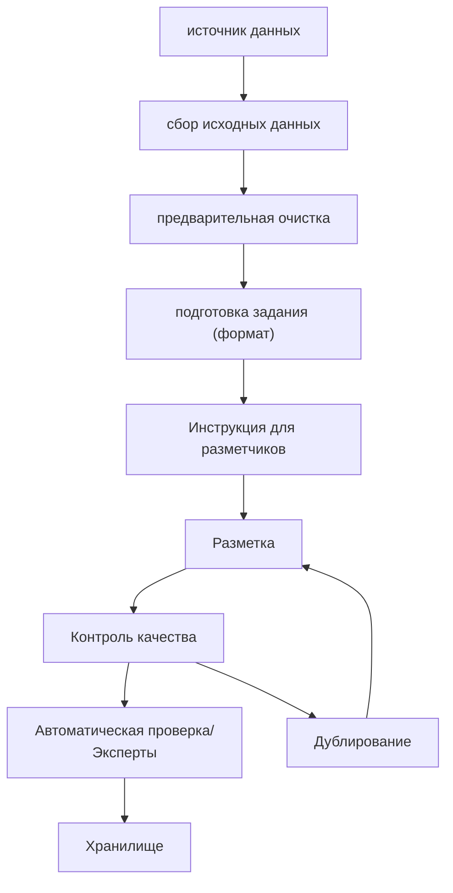

### Источники данных:
- сайты
- соц. сети
- каналы (текст, подкасты, видео)
- CRM, ERP. MES
- Опросы
- Изображения, галереи
- Промышленные датчики

### Сбор исходных данных:
- Data Lake / RAM (если данных мало, а оперативы много)
- Объём / Скорость загрузки
- Челлендж для Data Engineer

### Предварительная очистка:
- Удаляем:
	- Дубликаты
	- Пропуски
	- Технические данные
	- Спам, шум, выбросы и очистки

### Подготовка задания:
- Формат результата
- Формируем задачу
- Приводим к нужному формату

### Инструкция для разметки:
- Цель: зачем делать разметку?
- Объект: что размечаем? Особенности формата входа.
- Результат. Формат выхода.
- Правило принятия решения. Детальность vs. Полнота
- Пограничные и спорные случаи
- Примеры
- Контрольный тест
- 70-80 % ошибок из-за низкого качества инструкций, неясные правила выполнения задания.
- "У каждой аварии есть Имя и Фамилия" ---> "Возле каждого важного элемента пайплайна должен быть ответственный"
- Ответственный исполнитель

### Хорошая инструкция:
- Четкая, понятная цель
- Краткое описание с простыми формулировками: входа / задачи / выхода / пограничных случаев (чаще чем 5% / 1% выборки)
- Много-много примеров, которые прошли через контрольный тест и системы контроля

### Разметка:
- Удобный и понятный инструмент (бинарная классификация, свайп вправо/влево)

### Система контроля качества:
- Дублирования  (коэффициент каппы Коэна)
- Тест в задачах
- Аналитика поведения:
	- Инструкция -> тест -> рейтинг -> показатели поведения -> разметка

### Типичные ошибки разметки:
- Невнимательность <<< усталость
- Неправильное выполнение инструкции 
- Случайные ответы