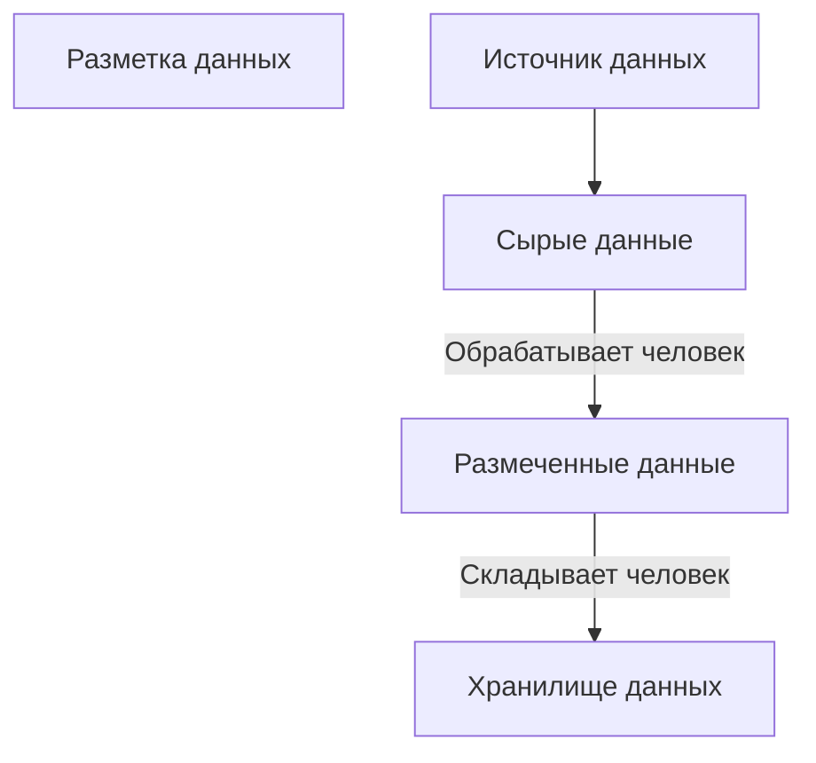

#### Критерии оценки при покупке данных
- Цена
- Качество
- Эксклюзивность
- Тестовая выборка (тут рисунок с котом в мешке)
- Актуальность, обновления
- Надёжность интерфейсов
- Безопасность
- Условия использования
- Формат
- Документация
- Объем
- Степень детализации 

> [!info] Цена
> <u>опр. 1</u>
> ROI (Return on Investment) — это коэффициент рентабельности инвестиций, показывающий процентное соотношение полученной прибыли к затратам
> $$
\frac{\text{Доход}-\text{Вложения}}{\text{Вложения}}\times100\%
> $$
> ROI > 0% — инвестиции прибыльны
> ROI < 0% — инвестиции убыточны
> 
> ROI > 50% — имеет смысл покупать
> ROI < 10% — маловато, не уделяем внимание такой сделке
> ROI > 100% — стремимся к этому
> ROI > 500% — укрываем прибыльную нишу в секрете (!!!)

> [!info] Эксклюзивность
> Насколько данные позволяют узнать то, что не знают все остальные.

> [!info] Условия использования
> Надо убедиться, что условия использования соответствуют тем задачам, для которых вы собираетесь использовать данные, чтобы не нарваться на проблемы с законом

Ручной сбор данных
- Можно получить качественные данные
- Можно получить уникальные данные
- Позволяет минимизировать *"мусор на входе → мусор на выходе"*

Автоматический сбор данных (← мб не это сюда нужно было написать)
- Сложный смысл и контекст
- Неоднозначность решений
- Необходимость понимания эмпатии
- Если бумажный носитель плохого качество

<u>опр. 2</u>
**Ручной сбор данных** - это процесс, при котором человек собирает, проверяет или размечает информацию, которую невозможно или дорого корректно получить автоматически 
Человек выступает учителем для машины

(•) Вот у нас есть сырые данные. Чем нужно обеспечить человека, чтобы он мог эффективно осуществлять ручной сбор данных?

Требования для эффективного ручного сбора данных
- Формулировка задачи
- Инструкция
- Пример
- Обеспечить инструментами
  → они должны быть удобны разметчику
- Обратная связь
- Проверка размеченных данных

> [!info] Инструкция
> Чтобы тот кто размечает сделал то, что вы от него хотите, нужно сделать правильную инструкцию.
> Чтобы можно было использовать массовый дешёвый труд, задача должна быть простой.
> Чёткие инструкции:
> открыл → прочитал → сделал 
> 
> Хорошие инструкции:
> - Цель
> - Постановка задачи
> - Описание вариантов решения
>   - Задача классификации - описание классов.
>   - Задача поиска данных - основные примеры данных, которые нужно найти
>   - Задача проверки качества - критерии оценки
> - Примеры
>   примеры правильных ответов, примеры ошибок
> - Спорные моменты
>   Здесь разбираем спорные примеры.
>   Классификация: если орёл/решка, а выпало ребро - в какой класс занести?
>   и т. д.
> - Дополнительные правила
>   которые рассказывают, что делать, если сомневаешься
>   - Задача классифицировать дорожные знаки. Что делать, если человек сомневается, какой перед ним дорожный знак? Можно, например, отложить.
>   - Извлекаете информацию → сомневается, это название города или улицы? Посмотри на каких-нибудь картах, есть такая улица или нет
>   и т. д.
> - Инструкция должна быть краткая и исчерпывающая

> [!example] Пример задачи
> - Цель - классификация отзывов
> - Категории
>   - положительный
>   - отрицательный
>   - нейтральный
> - Пример отзыва
>   - Мне очень не понравилось, доставка ужасная
>     Решение: отрицательный отзыв

Например: 
**Текст отзыва** → человек определяет тональность
**Фото** → человек может выделять объекты
**Капча** → человек может проходить её
**Резюме** → навыки, технологии, решение
**Сайты компаний** → ищет контакты, резюмирует предложение
**Анкеты** → проверяет корректность и добросовестность 

> [!warning] Мега бизнес план кошелева
> Можно написать промпт и попросить нейросеть найти все объявления по ручной разметке
> → посмотреть на эти объявления → поискать на гитхабе модельки, которые решают эти задачи → можно предлагать свои услуги по ручной разметке

Задачи ручного сбора
- Классификация
- Извлечение информации
- Поиск данных
- Проверка качества

> [!info] Классификация
> > [!example] Определить тональность отзыва
>
> > [!example]- Понять, правильно ли выполнен гимнастический элемент
> > Вы хотите обучить нейросеть, как научить нейросеть понимать, правильно выполнен элемент художественной гимнастики или нет?
> > (правильно на шпагат сел или не)
> > Как собрать датасет для подобной задачи?
> > → Нарезать видео, собрать специалистов, разметить.

> [!info] Извлечение информации
> Например, есть архив рукопИсей 18-го века
> Вы хотите научить нейросеть распизнавать кириллицу 18 века

> [!info] Поиск данных
> Пишите научную статью. Можете попросить нейросеть создать список литературы.

(•) sample - единица сырых данных

<u>опр. 3</u>
**Краудсорсинг** — распределение задач между очень большим количеством людей через интернет.

Что делать, если счёт образцов идёт на миллионы
- Взять инструмент по лучше
- Краудсорсинг
  — распределение задач между очень большим количеством людей через интернет
  если не хватает одной команды разметчиков - нужно сделать кластер команд, чтобы много команд работало над вашей задачей

> [!info] Краудсорсинг
> 1. Перед нами стоит задача сбора или разметки данных
> 2. Мы эту задачу размещаем на платформе
> 3. Платформа эту задачу делегирует исполнителям (которых здесь много)
> 4. Платформа со всех исполнителей собирает решения
> 5. Платформа проверяет решения
> 6. Платформа отгружает в хранилища готовые решения
> 
> Плюсы: 
> - Скорость
> - Цена
> - Масштабируемость
> 
> Минусы:
> - Качество разметки вызывает вопросы
> 
> Подходы к минимизации ошибки
> - Выборочный контроль
>   Один размечает, другой контролирует
>   Минус - цена: контролёру нужно платить больше, чем рабочему.
> - Дублирование работы
>   Берём решение большинства. Тут играет роль математическое ожидание.
>   Самое эффективное дублирование - знать, кто в чём хорош и учитывать мнение лучшего в этой области.
>   Для измерения согласия экспертов используется:
>   

насколько фото нужны нам?? (чисто для приколов думаю)
оцениванием:
1. Миша - 4/10 
2. Влад - 5/10 
3. Рома - 8/10 не только фото, просто любые типы файлов
Сколько она там стоит?? 5$ → 388 rub / 3 = 129,3333333333
5$ → 388 rub // 3 = 129

