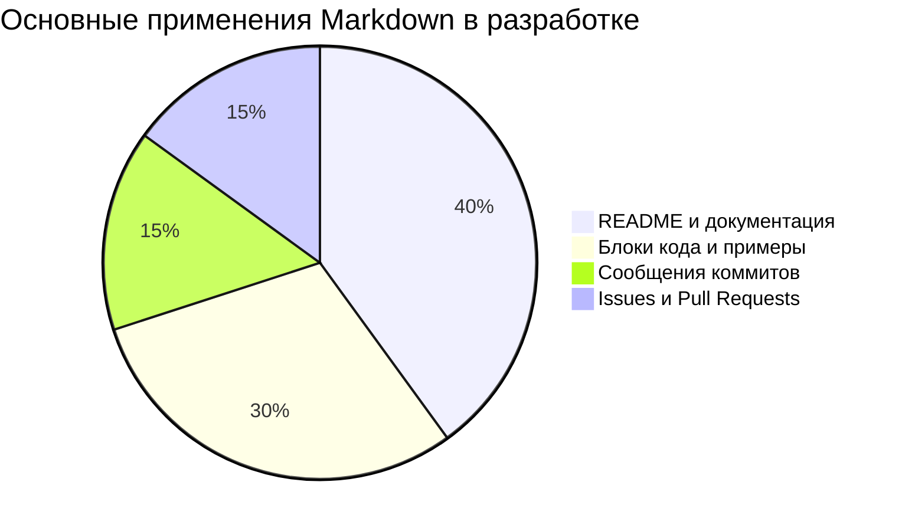
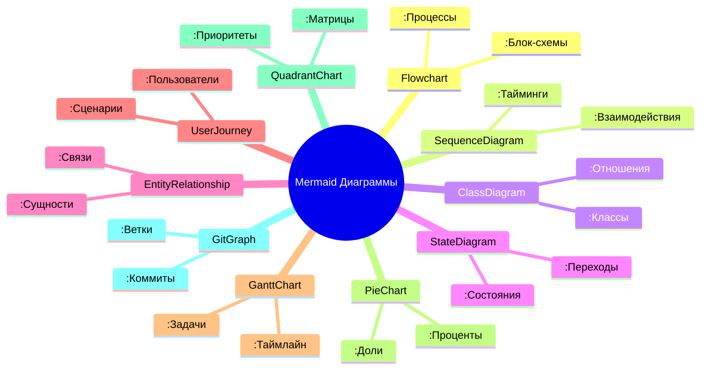
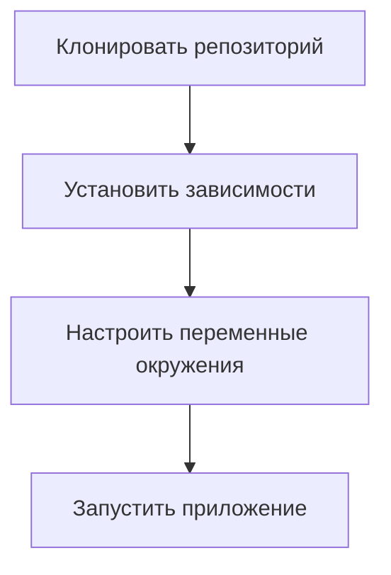
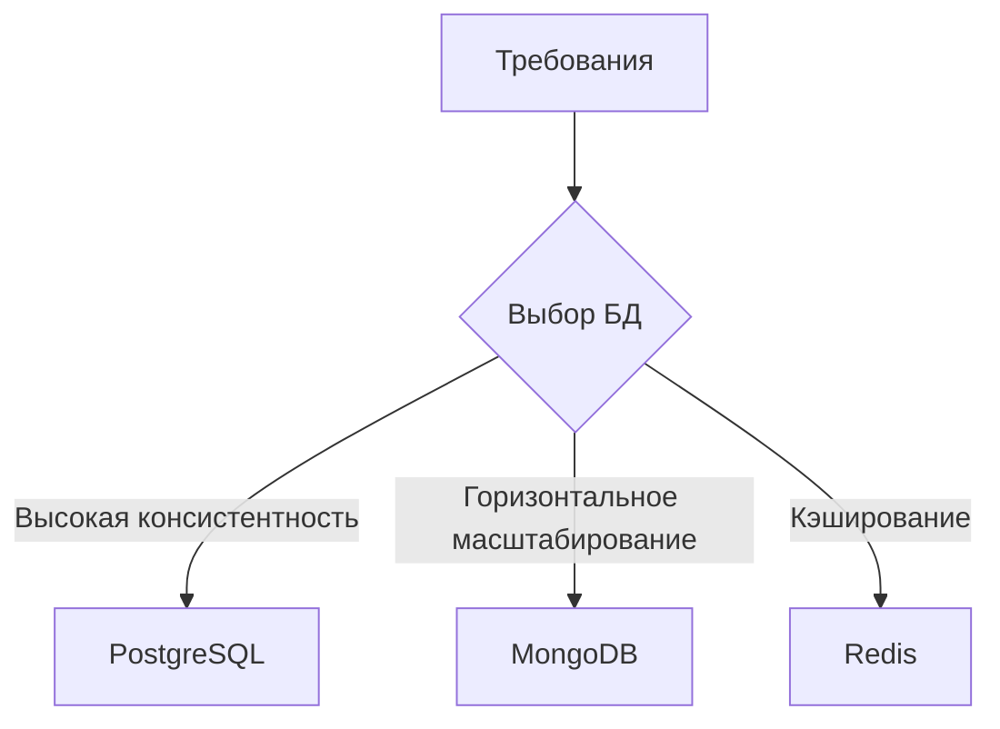
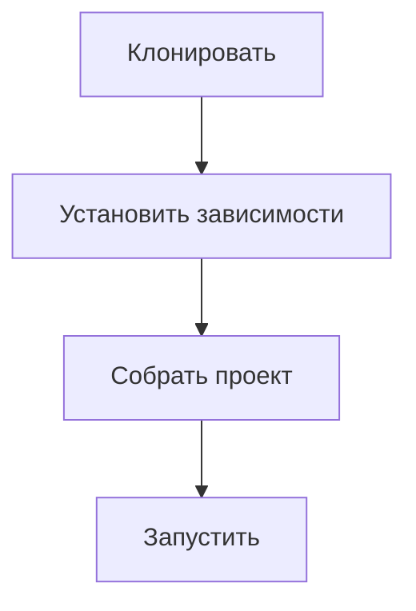
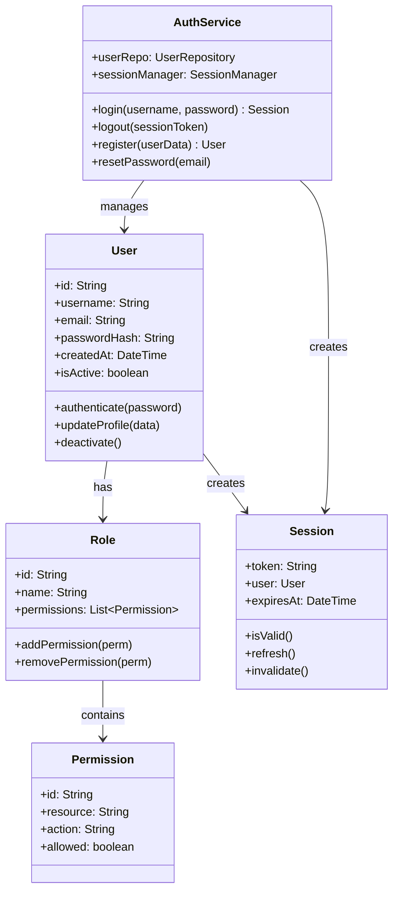
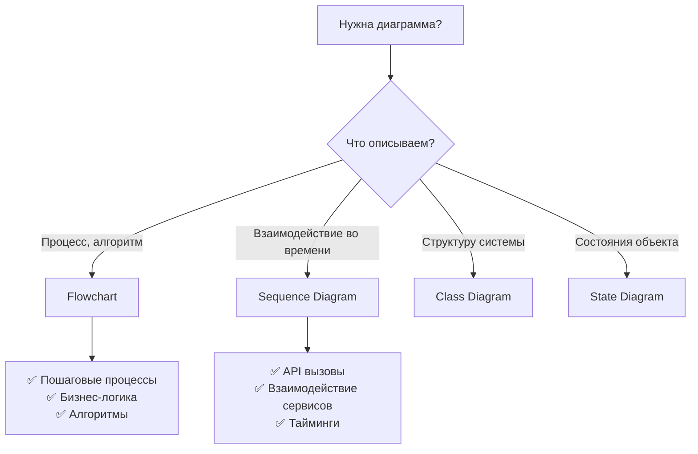
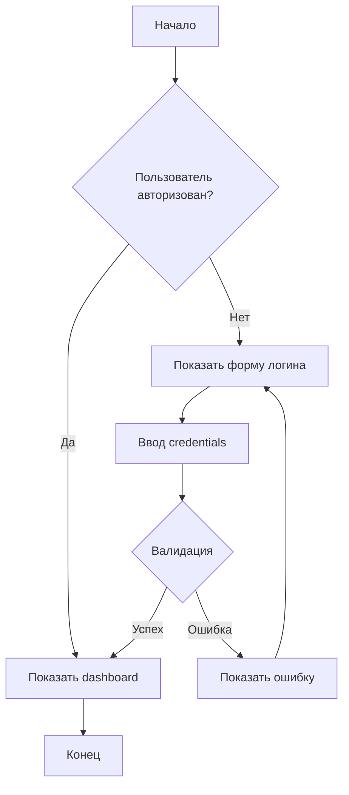
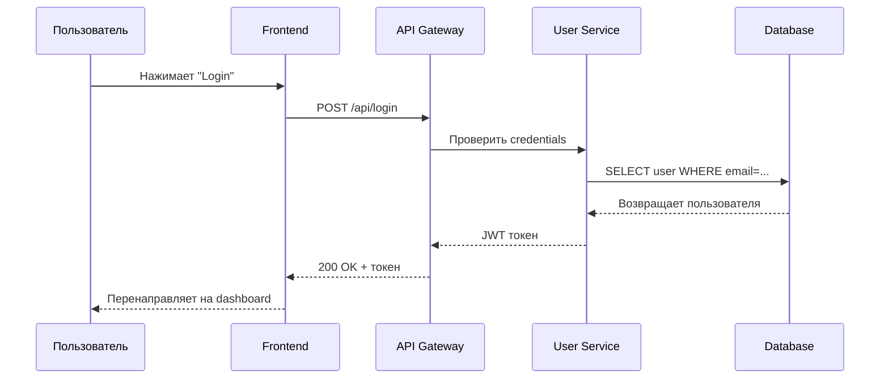

> [!abstract] Языки разметки для разработчиков
> Инструменты для создания структурированной документации и визуализации архитектуры с помощью простого текстового синтаксиса.

---

## 1. Что такое Markdown?

**Markdown** — это облегченный язык разметки с простым синтаксисом форматирования, который конвертируется в валидный HTML. Создан Джоном Грубером в 2004 году с целью сделать письмо для веба простым и читаемым как в исходном виде, так и после преобразования.

> [!quote] Философия Markdown
> "Формат чтения должен быть таким же приятным, как и формат написания."

**Ключевые характеристики:**
- **Человекочитаемый** — понятен даже без рендеринга
- **Легковесный** — минимальный синтаксис
- **Универсальный** — поддерживается везде (GitHub, GitLab, Obsidian, VS Code)
- **Конвертируемый** → HTML, PDF, DOCX, и другие форматы

---

## 2. Почему Markdown популярен в разработке вместо Word документов?

| Аспект | **Markdown** | **Microsoft Word** |
|--------|--------------|-------------------|
| **Версионный контроль** | ✅ Отлично работает с Git | ❌ Бинарные файлы сложно мержить |
| **Читаемость в коде** | ✅ Человекочитаемый plain text | ❌ XML/бинарный формат |
| **Размер файлов** | ✅ Килобайты | ❌ Мегабайты |
| **Автоматизация** | ✅ Легко генерировать/обрабатывать | ❌ Сложная автоматизация |
| **Кроссплатформенность** | ✅ Любой текстовый редактор | ❌ Требуется Word/LibreOffice |
| **Совместная работа** | ✅ Легко ревьювить изменения | ❌ Сложно отслеживать правки |

**Конкретные преимущества для разработчиков:**

```markdown
# Пример: Как это выглядит в Git
commit abc123
Author: Dev <dev@example.com>
Date:   Mon Dec 1 12:00:00 2024

- Added API documentation
- Fixed typo in README
- Updated installation steps

# В Word: "Document1_edited_final_v2_revised_FINAL.docx"
```

**Технические причины:**
1. **Git-friendly** — diff'ы понятны, merge conflicts разрешимы
2. **CI/CD integration** — можно генерировать документацию автоматически
3. **Code review** — изменения легко проверять в Pull Requests
4. **Portability** — не зависит от конкретного софта или ОС

---

## 3. Назовите три основных применения Markdown в разработке



**1. Документация проектов (README файлы)**
```markdown
# Project Name


## 📦 Installation
```bash
npm install my-package
```

## 🚀 Usage
```javascript
import { MyModule } from 'my-package';
```

## 🤝 Contributing
Please read CONTRIBUTING. Md for details.
```
**2. Техническая документация и Wiki**
- API documentation (например, с использованием MkDocs или Docusaurus)
- Architecture decision records (ADRs)
- Code style guides
- Troubleshooting guides
- Tutorials and how-tos

**3. Коммуникация в проекте**
```markdown
# GitHub/GitLab Issues
**Bug Report**
- **OS**: Windows 11
- **Version**: 2.1.0
- **Steps to reproduce**:
  1. Click button X
  2. Observe error Y

# Pull Request Descriptions
## Changes
- Added feature Z
- Fixed bug #123

## Testing
- [x] Unit tests pass
- [ ] Integration tests pass
```

**Дополнительные применения:**
- **Сообщения коммитов** — структурированные описания изменений
- **Презентации** — с использованием Marp, Reveal. Js
- **Блоги и статьи** — на GitHub Pages, Hugo, Jekyll
- **Конфигурационные файлы** — некоторые инструменты поддерживают Markdown в конфигах

---

## 4. Как создать заголовок первого уровня в Markdown?

**Способ 1: Использование `#` (рекомендуется)**
```markdown
# Заголовок первого уровня
```

**Способ 2: Альтернативный синтаксис (под заголовком)**
```markdown
Заголовок первого уровня
=======================
```

**Иерархия заголовков:**
```markdown
# H1 - Заголовок первого уровня
## H2 - Заголовок второго уровня
### H3 - Заголовок третьего уровня
#### H4 - Заголовок четвертого уровня
##### H5 - Заголовок пятого уровня
###### H6 - Заголовок шестого уровня
```

> [!tip] Лучшие практики
> 1. Используйте только один H 1 на документ
> 2. Соблюдайте иерархию (не перескакивайте уровни)
> 3. Добавляйте пробел после `#`

---

## 5. Как создать жирный текст в Markdown?

**Способ 1: Двойные звездочки `**` (рекомендуется)**
```markdown
Это **жирный текст** в предложении.
```

**Способ 2: Двойные подчеркивания `__`**
```markdown
Это __альтернативный способ__ сделать жирный текст.
```

**Способ 3: HTML тег `<strong>` (если нужно больше контроля)**
```markdown
Это <strong>жирный текст</strong> через HTML.
```

**Комбинирование с курсивом:**
```markdown
***Это и жирный, и курсивный текст***
**_Или так_**
__*Или так*__
```

**Рендеринг:**
- Это **жирный текст** в предложении.
- Это __альтернативный способ__ сделать жирный текст.
- Это <strong>жирный текст</strong> через HTML.
- ***Это и жирный, и курсивный текст***

---

## 6. Как создать ссылку в Markdown?

**Способ 1: Встроенная ссылка**
```markdown
[Текст ссылки](https://example.com)
```
Рендеринг: [Текст ссылки](https://example.com)

**Способ 2: Ссылка с title (всплывающая подсказка)**
```markdown
[GitHub](https://github.com "Перейти на GitHub")
```

**Способ 3: Ссылки-сноски (для повторного использования)**
```markdown
Это ссылка на [Google][1], а это на [GitHub][2].

[1]:  https://google.com "Поисковая система"
[2]:  https://github.com
```

**Способ 4: Автоматические ссылки (для URL и email)**
```markdown
<https://example.com>
<email@example.com>
```

**Способ 5: Ссылка на раздел внутри документа**
```markdown
[Перейти к установке](#установка)

## Установка
Текст раздела...
```

**Способ 6: Относительные ссылки (внутри репозитория)**
```markdown
[Лицензия](LICENSE.md)
[Исходный код](./src/main.py)
```

---

## 7. Как создать блок кода в Markdown?

**Способ 1: Блок кода с отступами (4 пробела или 1 таб)**
```markdown
    // Это блок кода
    function hello() {
        Console.Log ("Hello, World!");
    }
```

**Способ 2: Тройные backticks ``` (рекомендуется)**
````markdown
```javascript
// JavaScript код с подсветкой синтаксиса
Function greet (name) {
    Return `Hello, ${name}!`;
}
```
````

**Способ 3: Тройные backticks с указанием языка для подсветки синтаксиса**
````markdown
```python
# Python код
Def calculate_sum (a, b):
    Return a + b
```

```bash
# Bash команда
Npm install --save-dev
```

```yaml
# YAML конфиг
Server:
  Port: 3000
  Host: localhost
```
````

**Способ 4: Inline код (внутри строки)**
```markdown
Используйте команду `npm start` для запуска приложения.
```

**Способ 5: Блок кода с подсветкой строк**
````markdown
```python hl_lines="2 4"
Def example ():
    Print ("Эта строка подсвечена")  # Подсвечена
    Print ("Эта нет")
    Print ("Эта тоже подсвечена")    # Подсвечена
```
````

**Поддерживаемые языки для подсветки синтаксиса:**
- `python`, `javascript`, `java`, `cpp`, `csharp`, `go`, `rust`
- `yaml`, `json`, `xml`, `sql`, `bash`, `powershell`
- `markdown`, `html`, `css`, `scss`
- `dockerfile`, `makefile`

---

## 8. Как создать таблицу в Markdown?

**Базовый синтаксис:**
```markdown
| Заголовок 1 | Заголовок 2 | Заголовок 3 |
|-------------|-------------|-------------|
| Ячейка 1    | Ячейка 2    | Ячейка 3    |
| Ячейка 4    | Ячейка 5    | Ячейка 6    |
```

**С выравниванием:**
```markdown
| Левый      | Центр       | Правый      | Числа     |
|:-----------|:-----------:|------------:|----------:|
| текст      | текст       | текст       | 100.00    |
| слева      | по центру   | справа      | 1,000.00  |
| выровнен   | выровнен    | выровнен    | 10,000.00 |
```

**Расширенный пример:**
```markdown
| Команда Git | Описание | Пример |
|-------------|----------|--------|
| `git clone` | Клонирует репозиторий | `git clone https://github.com/user/repo.git` |
| `git status` | Показывает состояние файлов | `git status` |
| `git commit` | Фиксирует изменения | `git commit -m "message"` |
| `git push` | Отправляет изменения на сервер | `git push origin main` |
```

**Рендеринг:**

| Команда Git | Описание | Пример |
|-------------|----------|--------|
| `git clone` | Клонирует репозиторий | `git clone https://github.com/user/repo.git` |
| `git status` | Показывает состояние файлов | `git status` |
| `git commit` | Фиксирует изменения | `git commit -m "message"` |
| `git push` | Отправляет изменения на сервер | `git push origin main` |

**Альтернативный синтаксис (некоторые парсеры):**
```markdown
Заголовок 1 | Заголовок 2 | Заголовок 3
----------- | ----------- | -----------
Ячейка 1    | Ячейка 2    | Ячейка 3
Ячейка 4    | Ячейка 5    | Ячейка 6
```

**Ограничения таблиц в Markdown:**
- ❌ Нет объединения ячеек (colspan/rowspan)
- ❌ Нет вложенных таблиц
- ❌ Ограниченное форматирование внутри ячеек
- ⚠️ Для сложных таблиц используйте HTML

---

## 9. Что такое Mermaid?

**Mermaid** — это JavaScript-библиотека для создания диаграмм и визуализаций с использованием текстового синтаксиса, подобного Markdown. Позволяет создавать диаграммы как код, который можно версионировать, ревьювить и поддерживать.

> [!quote] Философия Mermaid
> "Генерация диаграмм из текста так же просто, как написание кода."

**Ключевые особенности:**
- **Текстовый синтаксис** — диаграммы как код
- **Встраиваемость** — работает в Markdown, HTML, документации
- **Автоматическое форматирование** — не нужно вручную располагать элементы
- **Поддержка Git** — diff'ы для диаграмм
- **Бесплатный и open-source** — MIT лицензия

**Поддерживаемые платформы:**
- ✅ GitHub/GitLab/GitVerse (нативная поддержка)
- ✅ Obsidian, VS Code (через плагины)
- ✅ Docusaurus, MkDocs (для документации)
- ✅ Веб-приложения (через CDN)

---

## 10. Назовите типы диаграмм в Mermaid



**Основные типы диаграмм:**

1. **Flowchart (Блок-схема)** — процессы, алгоритмы
2. **Sequence Diagram (Диаграмма последовательности)** — взаимодействие объектов во времени
3. **Class Diagram (Диаграмма классов)** — структура классов и их отношения
4. **State Diagram (Диаграмма состояний)** — состояния системы и переходы
5. **Entity Relationship Diagram (ERD)** — сущности и связи в БД
6. **User Journey Map** — путь пользователя через систему
7. **Gantt Chart (Диаграмма Ганта)** — расписание задач
8. **Pie Chart (Круговая диаграмма)** — пропорции, доли
9. **Quadrant Chart** — матрица приоритетов (например, Eisenhower Matrix)
10. **Git Graph** — визуализация ветвления Git

---

## 11. Почему Mermaid полезен в документации?

**Преимущества Mermaid для технической документации:**

| Преимущество | Описание | Пример использования |
|-------------|----------|---------------------|
| **Версионный контроль** | Диаграммы как текст в Git | Изменения диаграмм видимы в diff'ах |
| **Обновляемость** | Легко править без графических редакторов | Fix typo → commit → диаграмма обновлена |
| **Консистентность** | Единый стиль для всех диаграмм | Автоматическое форматирование |
| **Доступность** | Текстовое описание доступно скринридерам | Alt-text для каждой диаграммы |
| **Интеграция с CI/CD** | Автоматическая генерация в пайплайнах | docs-build → генерирует все диаграммы |
| **Коллаборация** | Легко ревьювить и комментировать | PR с изменениями диаграмм |

**Конкретные сценарии использования:**

```markdown
# В архитектурной документации
## Системная архитектура
```mermaid
Graph TD
    A[Пользователь] --> B[Frontend]
    B --> C[API Gateway]
    C --> D[Микросервис A]
    C --> E[Микросервис B]
```

# В README файле
## Установка


# В ADR (Architecture Decision Record)
## Решение: Выбор базы данных


## 12. Почему диаграммы в Mermaid лучше, чем PNG изображения диаграмм?

**Сравнение Mermaid vs PNG/JPEG:**

| Критерий | **Mermaid (текст)** | **PNG/JPEG (изображение)** |
|----------|---------------------|----------------------------|
| **Версионный контроль** | ✅ Diff'ы показывают изменения | ❌ Бинарный файл, diff бесполезен |
| **Размер файла** | ✅ Килобайты текста | ❌ Мегабайты изображений |
| **Редактируемость** | ✅ Легко править текстом | ❌ Нужен графический редактор |
| **Доступность** | ✅ Текст доступен скринридерам | ❌ Требует alt-text вручную |
| **Масштабирование** | ✅ Векторное отображение | ❌ Растровое, пикселизация |
| **Поиск** | ✅ Можно искать по тексту | ❌ Текст не ищется |
| **Темная тема** | ✅ Автоматическая адаптация | ❌ Фиксированные цвета |
| **CI/CD** | ✅ Автогенерация в пайплайнах | ❌ Ручная генерация |
| **Совместная работа** | ✅ Легко ревьювить в PR | ❌ Сложно комментировать изменения |

**Пример проблемы с PNG:**
```bash
# В Git истории
Commit 1: Добавил диаграмму architecture_v 1. Png
Commit 2: Исправил опечатку на диаграмме → architecture_v 2. Png
Commit 3: Обновил цвета → architecture_v 3. Png
# Теперь 3 версии файла, каждая 2 MB, diff'ы бесполезны
```

**Пример преимущества Mermaid:**
```bash
# В Git истории
Commit 1: Добавил диаграмму architecture. Mmd
# Diff показывает:
-    A[Client] --> B[Server]
+    A[Web Client] --> B[API Server]
# Понятно что изменилось, файл 1 KB
```

**Техническое преимущество:**
```markdown
<!-- PNG (статичный) -->


<!-- Mermaid (динамичный, адаптивный) -->
```mermaid
Graph TD
    A[Клиент] --> B[Сервер]
    B --> C[(База данных)]
```


## 13. Как встроить Mermaid диаграмму в GitHub/GitVerse README?

**Способ 1: Нативная поддержка (GitHub/GitLab/GitVerse)**
```markdown
# README. Md

## Архитектура системы
```mermaid
Graph TD
    A[Пользователь] --> B[Frontend App]
    B --> C[Backend API]
    C --> D[(Database)]
```

## Процесс установки


**Способ 2: Для платформ без нативной поддержки (HTML)**
```html
<!DOCTYPE html>
<html>
<head>
    <script src="https://cdn.jsdelivr.net/npm/mermaid/dist/mermaid.min.js"></script>
    <script>
        Mermaid.Initialize ({ startOnLoad: true });
    </script>
</head>
<body>
    <div class="mermaid">
        Graph TD
            A[Клиент] --> B[Сервер]
            B --> C[(БД)]
    </div>
</body>
</html>
```

**Способ 3: В Obsidian (через плагин)**
````markdown
```mermaid
SequenceDiagram
    Participant U as Пользователь
    Participant S as Сервер
    U->>S: Запрос данных
    S->>S: Обработка
    S-->>U: Ответ
```
````

**Способ 4: В VS Code (через расширение)**
1. Установить расширение "Markdown Preview Mermaid Support"
2. Создать `. Md` файл с диаграммами
3. Открыть предпросмотр (Ctrl+Shift+V)

**Способ 5: Автоматическая генерация в CI/CD**
```yaml
# .github/workflows/docs. Yml
Jobs:
  Build-docs:
    Runs-on: ubuntu-latest
    Steps:
      - uses: actions/ checkout@v3
      - Name: Generate diagrams
        Run: |
          # Скрипт генерирует Mermaid диаграммы из конфигов
          Python generate_diagrams. Py
      - Name: Deploy to GitHub Pages
        uses: peaceiris/ actions-gh-pages@v3
```

**Проверка поддержки:**
- ✅ **GitHub** — поддерживает с 2022 года
- ✅ **GitLab** — поддерживает с версии 13.2+
- ✅ **GitVerse** — предположительно поддерживает (как современная платформа)
- ✅ **Obsidian** — через плагин
- ✅ **VS Code** — через расширения
- ❌ **Обычные Markdown парсеры** — требуют pre-processing

---

## 14. Приведите пример, когда class diagram в Mermaid полезен для документации кода.

**Class Diagram (Диаграмма классов)** полезна когда нужно документировать структуру объектов, их отношения, методы и свойства — особенно в ООП проектах.

**Пример: Документация системы управления пользователями**



**Полезность этой диаграммы:**

1. **Понимание структуры** — видна связь между User, Role, Permission
2. **Документация атрибутов** — поля классов видны сразу
3. **Отношения между классами** — агрегация, композиция, зависимости
4. **Публичный API** — методы классов показывают, что можно делать
5. **Для новых разработчиков** — быстрый обзор архитектуры модуля

**Другие сценарии использования class diagram:**

| Сценарий | Что документирует |
|----------|-------------------|
| **Модели данных** | Сущности БД и их связи |
| **Сервисный слой** | Сервисы и их зависимости |
| **DTO/ViewModel** | Структуры данных для API |
| **Паттерны проектирования** | Реализации Factory, Strategy и т. Д. |
| **Интерфейсы и абстракции** | Контракты между модулями |

---

## 15. Когда использовать flowchart, а когда sequence diagram в Mermaid?

**Критерии выбора типа диаграммы:**




**Flowchart (Блок-схема) используем когда:**
1. **Процессы и алгоритмы** — последовательность шагов
2. **Принятие решений** — ветвление логики (if/else)
3. **Бизнес-процессы** — как работает бизнес-логика
4. **Установка/настройка** — шаги для пользователей
5. **Потоки данных** — как данные движутся через систему

**Пример flowchart:**


**Sequence Diagram (Диаграмма последовательности) используем когда:**
1. **Взаимодействие компонентов** — кто кому и что отправляет
2. **Временные последовательности** — порядок событий во времени
3. **API коммуникация** — запросы/ответы между клиентом и сервером
4. **Асинхронные процессы** — колбэки, промисы, события
5. **Распределенные системы** — взаимодействие микросервисов

**Пример sequence diagram:**



**Сравнительная таблица:**

| Аспект | Flowchart | Sequence Diagram |
|--------|-----------|------------------|
| **Фокус** | Что происходит | Кто с кем взаимодействует |
| **Время** | Неявно | Явно (сверху вниз = время) |
| **Акторы** | Обычно один | Множество участников |
| **Лучше для** | Алгоритмов, процессов | Коммуникации, протоколов |
| **Сложность** | Простые решения | Сложные взаимодействия |

---

## 16. Как создать простую блок-схему в Mermaid?

**Базовый синтаксис для блок-схем:**

````markdown
```mermaid
Graph TD
    A[Начало] --> B{Решение?}
    B -->|Да| C[Действие 1]
    B -->|Нет| D[Действие 2]
    C --> E[Конец]
    D --> E
```
````

**Пошаговое создание блок-схемы:**

1. **Определите направление графа:**
   ````markdown
   ```mermaid
   Graph TD  # Top-Down (сверху вниз)
   ```
   
   ```mermaid
   Graph LR  # Left-Right (слева направо)
   ```
   
   ```mermaid
   Graph RL  # Right-Left (справа налево)
   ```
   
   ```mermaid
   Graph BT  # Bottom-Top (снизу вверх)
   ```
   ````

2. **Создайте узлы с разными формами:**
   ````markdown
   ```mermaid
   Graph TD
       A[Прямоугольник]
       B{Ромб - решение}
       C ((Круг))
       D>Ассиметричный]
       E {{Шестиугольник}}
       F[/Параллелограмм/]
       G[\Другой параллелограмм\]
   ```
   ````

3. **Добавьте связи между узлами:**
   ````markdown
   ```mermaid
   Graph TD
       A --> B           # Сплошная стрелка
       A -.-> C          # Пунктирная стрелка
       A ==> D           # Толстая стрелка
       A -- текст --> E  # Стрелка с текстом
       A -->|да| F       # Альтернативный синтаксис
       A --o G           # Кружок на конце
       A --x H           # Крест на конце
   ```
   ````

**Полный пример блок-схемы процесса логина:**

````markdown
```mermaid
Graph TD
    Start ([Начало]) --> Visit[Пользователь посещает сайт]
    Visit --> Check{Авторизован?}
    
    Check -->|Да| Dashboard[Показать Dashboard]
    Check -->|Нет| LoginForm[Показать форму логина]
    
    LoginForm --> Input[Ввод email/password]
    Input --> Validate{Валидация данных}
    
    Validate -->|Успех| Auth[Аутентификация]
    Validate -->|Ошибка| Error[Показать ошибку валидации]
    Error --> LoginForm
    
    Auth --> Verify{Данные верны?}
    Verify -->|Да| Success[Создать сессию]
    Verify -->|Нет| AuthError[Показать ошибку аутентификации]
    AuthError --> LoginForm
    
    Success --> Redirect[Перенаправить на Dashboard]
    Redirect --> End ([Конец])
    Dashboard --> End
```
````

**Стилизация блок-схемы:**

````markdown
```mermaid
Graph TD
    A[Начальный узел] --> B{Решение}
    B -->|Путь 1| C[Успех]
    B -->|Путь 2| D[Неудача]
    
    style A fill: #f9f , stroke: #333 , stroke-width:4px
    style B fill: #bbf , stroke: #f66 , stroke-width: 2 px, stroke-dasharray: 5 5
    style C fill: #bfb , stroke: #3c3
    style D fill: #fbb , stroke: #c33
    
    linkStyle 0 stroke: #ff3 , stroke-width: 2 px
    linkStyle 1 stroke: #3f3 , stroke-width: 2 px
    linkStyle 2 stroke: #f33 , stroke-width: 2 px
```
````

**Полезные советы:**
1. Используйте `TD` для вертикальных процессов
2. Используйте `LR` для горизонтальных процессов (например, пайплайны CI/CD)
3. Добавляйте комментарии в диаграмму для сложных логик
4. Разбивайте большие диаграммы на подграфы
5. Используйте стили для выделения важных частей

---

## 17. Что означает `TD` в Mermaid и какие есть альтернативы?

**`TD`** в Mermaid означает **"Top Down"** (сверху вниз) — это направление, в котором строится граф. Указывается в первой строке определения диаграммы.

**Подробное описание каждого направления:**

| Код | Название | Направление | Когда использовать |
|-----|----------|-------------|-------------------|
| **`TD`** | Top Down | Сверху вниз | ✅ **По умолчанию**<br/>✅ Процессы, алгоритмы<br/>✅ Бизнес-процессы |
| **`LR`** | Left Right | Слева направо | ✅ CI/CD пайплайны<br/>✅ Горизонтальные процессы<br/>✅ Временные линии |
| **`RL`** | Right Left | Справа налево | ✅ Арабский/ивр. Текст<br/>✅ Специфичные требования<br/>✅ Обратные процессы |
| **`BT`** | Bottom Top | Снизу вверх | ⚠️ Редко<br/>⚠️ Специфичные случаи |

**Примеры использования разных направлений:**

**TD (Top Down) — для алгоритмов:**
````markdown
```mermaid
Graph TD
    Start ([Начало]) --> Process[Обработать данные]
    Process --> Decision{Успешно?}
    Decision -->|Да| Success[Завершить]
    Decision -->|Нет| Error[Обработать ошибку]
    Error --> Process
```
````

**LR (Left Right) — для CI/CD пайплайнов:**
````markdown
```mermaid
Graph LR
    A[Код] --> B[Сборка]
    B --> C[Тестирование]
    C --> D[Деплой в staging]
    D --> E[Ручное тестирование]
    E --> F[Деплой в production]
```
````

**RL (Right Left) — для специфичных сценариев:**
````markdown
```mermaid
Graph RL
    Z[Конец] --> Y[Шаг 3]
    Y --> X[Шаг 2]
    X --> W[Шаг 1]
    W --> V[Начало]
```
````

**Выбор направления в зависимости от контента:**

1. **Вертикальный контент** (процессы, алгоритмы) → `TD`
2. **Горизонтальный контент** (пайплайны, timeline) → `LR`
3. **Языки справа налево** (арабский, иврит) → `RL`
4. **Снизу вверх** (редко, специфично) → `BT`

**Динамическое изменение направления внутри диаграммы:**
````markdown
```mermaid
Graph TD
    A[Вертикальный блок] --> B
    
    Subgraph Horizontal[Горизонтальный подграф]
        Direction LR
        C --> D --> E
    End
    
    B --> Horizontal
    Horizontal --> F[Снова вертикально]
```
````

> [!tip] Рекомендация
> Используйте `TD` по умолчанию, так как это наиболее естественное направление для чтения процессов на большинстве языков. Переключайтесь на `LR` только когда у вас действительно горизонтальный процесс (например, pipeline).

---

> [!summary] Итоговые выводы
> 1. **Markdown** — стандарт для документации в разработке благодаря простоте и Git-совместимости
> 2. **Mermaid** — революционный инструмент для создания версионируемых диаграмм как код
> 3. **Синтаксис Markdown** прост, но мощён — от заголовков до таблиц и кода
> 4. **Типы диаграмм Mermaid** покрывают все потребности — от блок-схем до диаграмм Ганта
> 5. **Текстовый формат** превосходит бинарные изображения для версионного контроля
> 6. **Направления графов** (`TD`, `LR`, `RL`, `BT`) позволяют адаптировать диаграммы под контент

