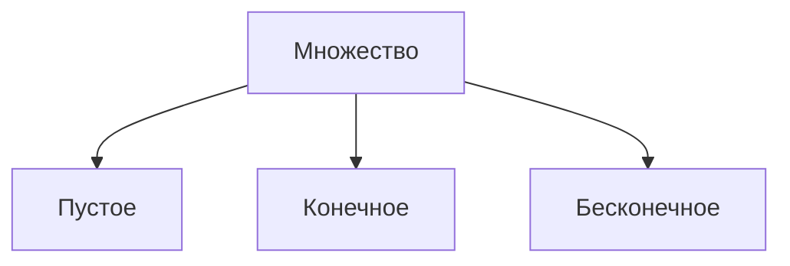

# Раздел 0. Множества. Функции.
## Лекция №1 Введение в курс.

Лекция №1 от 16.09.2025
Лектор: Башуров Вячеслав Владимирович

Множество
<u>опр.</u>
• Под множеством понимается ”набор”, ”коллекция”,
”совокупность” и т.п. объектов, объединенных каким-либо общим свойством.

• Предметы или объекты, составляющие множество,
называются элементами множества.
Множества обозначают большими буквами А, В, С... , а их элементы а, b, с... — малыми буквами латинского алфавита.

• Если а — элемент множества А , то $a\in A$ и читают: ”а
принадлежит А” , в противном случае $a\notin A$ или $a\overline{\in} A$ и читают: ”а не принадлежит А”

<u>опр.</u>
• $A\subseteq B$ — множество А является подмножеством В множества ; при этом каждый элемент множества А является элементом множества В

• $A\subset B$ — множество А является собственным подмножеством множества В ; здесь существует хотя бы один элемент множества В, не принадлежащий множеству А

• $A= B$ — равны множества, если одновременно $A\subseteq B$ и $B\subseteq A$

• Множество, не содержащее ни одного элемента, называется пустым. Обозначается $\varnothing$

<u>Свойства:</u>
1. пустое множество $\varnothing$ является собственным подмножеством всякого не пустого множества, т.е. $\varnothing\subset B$
2. любое множество — несобственное подмножество самого себя $B\subseteq B$
3. для произвольных множеств А, В, С если $A\subseteq B$ и $B\subseteq C$ , то $A\subseteq C$

• **Задать множество** можно либо перечислением **всех** его элементов, либо указанием **характеристического** свойства элементов множества. Например, множество А = {+; - ; 1; 0} — задано перечислением его четырех элементов.
Множество $X =\{x\in\mathbb{N}:x^2=1\}$ состоит из натуральных чисел, **таких, что** квадрат этих чисел равен единице, т.е. Х = {1}

Числовые множества
<u>опр.</u>
$\mathbb{N}=\{1,2,3\ldots n,\ldots\}=\{n\}^{\infty}_{n=1}$ - множество **всех** натуральных чисел
$\mathbb{Z}=\{\ldots,-3,-2,-1,0,1,2,3\ldots\}=\{n\}^{\infty}_{n=-\infty}$ - множество **всех** целых чисел
$\mathbb{Q}=\bigg\{\frac{n}{m},n\in\mathbb{Z},m\in\mathbb{N},НОД\{|n|,m\}=1\bigg\}$ - множество всех рациональных чисел
$\mathbb{I}$ - множество всех иррациональных чисел
$\mathbb{R}=(-\infty,+\infty) = \mathbb{Q}+ \mathbb{I}$ - множество всех действительных чисел

Операции над множествами
1. Объединение (сумма) $A\cup B=\{x:x\in A\text{ или }x\in B\}$
2. Пересечение (произведение) $A\cap B=\{x:x\in A\text{ и }x\in B\}$
3. Разность $A\backslash B=\{x:x\in A\text{ и }x\notin B\}$

Свойства операций над множествами
ыы

Классификация множеств

<u>опр.</u>
Пусть Х и Y - два непустых множеств. Если существует отображение (закон) f такой, что:
1. всякому x in Х соответствует образ y = f(x) in Y;
2. всякому y in y соответствует прообраз x такой, что  f(x) = y;
3. различные x1 и x2 (x1 $\neq$ x2) соответствуют несовпадающие образы,
то говорят, что правило f: X -> Y определяет взаимно-однозначное соответствие между множествами X и Y; при этом множества называют **эквивалентными** и записывают Х ~ Y

<u>опр.</u>
Множество Х - **конечное**, если существует натуральное число k, такое, что X ~ {1, 2, 3, ..., k} = Nk.

<u>опр.</u>
Множество X - **бесконечное**, если оно не является конечным, т. е. для любого натурального числа k множество X не эквивалентно множеству $N_{k}$.

<u>опр.</u>
Количественная характеристика всякого бесконечного множества, обобщающая понятие количества элементов конечного множества, - **МОЩНОСТЬ** множества.

<u>опр.</u>
Бесконечное множество называется **счётным**, если оно эквивалентно множеству всех натуральных чисел
(X - бесконечное счётное) $\iff$ (X~N)

<u>опр.</u>
Бесконечное множество, не являющееся счётным, называется **несчётным**. Среди несчётных множеств выделяем те из них, которые эквивалентны (равномощны) множеству всех чисел промежутка (0;1)
Всем несчётным множествам, эквивалентным множеству (0;1), сопоставляется символ $\mathfrak{c}$  - мощность "континуум".

Понятие числовой последовательности

<u>опр.</u>
Если каждому натуральному числу n поставлено в соответствие по определённому число x in X, то говорят, что задана числовая последовательность $\{x_{n}\}$.

Понятие функции

<u>опр.</u>
Функцией f, действующей из множества X в множество У, называется правило, по которому каждому элементу множества Х ставится в соответствие единственный элемент множества У. При этом множество Х называется **областью определения** функции f (обозначается D(f)), а множество У называется **областью значений** функции f (обозначается E(f)).

Способы задания функции

<u>опр.</u>
Если задана функция f, которая определена на множестве Х и принимает значения в множестве У, то есть, функция f отображает множество Х в Y, то f: X-> Y или X -f-> Y

1. **Аналитический способ**
Функция задаётся в виде одной или нескольких формул или уравнений

2. **Графический способ**
Числовые функции можно также задавать с помощью графика

3. **Табличный способ**
Числовые функции можно также задавать с помощью ряда значений аргумента и соответствующих значений функции.

Cвойства функции
1. **Возрастание и убывание**
Пусть дана функция y = f(x), тогда
- функция f называется неубывающей на X, если $\forall x_1, x_2, \in X: x_1 > x_2 \implies f(x_1) \geq f(x_2)$
- функция f называется возрастающей на X, если $\forall x_1, x_2, \in X: x_1 > x_2 \implies f(x_1) > f(x_2)$
- функция f называется невозрастающей на X, если $\forall x_1, x_2, \in X: x_1 > x_2 \implies f(x_1) \leq f(x_2)$
- функция f называется убывающей на X, если $\forall x_1, x_2, \in X: x_1 > x_2 \implies f(x_1) < f(x_2)$

<u>опр.</u>
Возрастающая или убывающая функция называется строго монотонной.

2. **Периодичность**
Пусть дана функция y = f(x), тогда функция y = f(x) называется периодической с периодом T != 0, если справедливо: $f(x+T) = f(x), \forall x \in X$

<u>опр.</u>
Наименьший положительный период, если он существует, называется основным периодом.

<u>опр.</u>
Если это равенство не выполнено, то функция f называется апериодической.

3. **Чётность**
Пусть дана функция y = f(x), тогда
- функция f: X -> R называется нечётной, если справедливо равенство: $f(-x) = -f(x), \forall x \in X$
- функция f: X -> R называется чётной, если справедливо равенство: $f(-x) = f(x), \forall x \in X$

<u>опр.</u>
Если не выполнено ни одно из этих равенств, то функция называется функцией общего вида.

4. **Ограниченность**
Пусть дана функция y = f(x), тогда
-  функция y = f(x) называется ограниченной сверху в области определения Х, если существует число М такое, что выполняется неравенство: $f(x) \leq M, \forall x \in X$
-  функция y = f(x) называется ограниченной снизу в области определения Х, если существует число М такое, что выполняется неравенство: $f(x) \geq M, \forall x \in X$

<u>опр.</u>
Функция y = f(x) называется ограниченной, если она ограничена и сверху, и снизу

Гиперболические функции

**Гиперболический синус:**
$$\boxed{
sh (x) = \frac{e^{ x }-e^{ -x }}{2}}
$$
**Гиперболический косинус:**
$$\boxed{
ch (x) = \frac{e^{ x }+e^{ -x }}{2}}
$$

Обратная функция
<u>опр.</u>
Пусть задана функция y = f(x) c областью определения D и множеством значений E. Если каждому y in E соответствует единственное значение x in D, то определена функция x = g(y) = f  (y), которая называется обратной к функции f(x)

<u>опр.</u>
Чтобы найти функцию x = g(y), обратную к функции y = f(x), достаточно просто решить уравнение f(x)=y относительно x (если это возможно)

<u>опр.</u>
Функция y = f(x) имеет обратную тогда и только тогда,  когда функция f(x) задаёт взаимно-однозначное соответствие между множествами D и E.

<u>опр.</u>
Любая строго монотонная функция имеет обратную.

---
# Раздел 1. Предел последовательности. Предел функции.
## Лекция №2 Числовые множества. Числовые последовательности.

Лекция №2 от 23.09.2025
Лектор: Башуров Вячеслав Владимирович

Свойства числовых множеств
1. Множество всех действительных чисел $\mathbb{R} = (-\infty , \infty)$ - бесконечное, мощности $\mathfrak{c}$

2.  $\mathbb{R} = \mathbb{Q} \cup \mathbb{I};\mathbb{N} \subset \mathbb{Z} \subset \mathbb{Q} \subset \mathbb{R}$

3. Между  $\mathbb{R}$ и точками числовой оси существует взаимно-однозначное соответствие, поэтому термины "точка" и "действительное число" взаимозаменяемы и, значит, числовые промежутки можно представлять геометрическими отрезками (с концами или без концов)

4. Если а и b  - произвольные действительный числа, то либо а=b, либо а<b, либо а>b, причём  если а<b, то b>a, а также a<b и b<c, то а<c (свойство упорядоченности)

5. Для любых различных действительных чисел найдётся действительное число "между" ними, например их полу сумме, т. е. $\forall a,c \in \mathbb{R}, (a<c) \implies (\exists b\in \mathbb{R}: a<b<c)$ или $\forall a,c \in \mathbb{R}, (a>c) \implies (\exists b\in \mathbb{R}: a>b>c)$ (свойство плотности)

6. Пусть X - произвольное числовое множество, $X \subset \mathbb{R}$
(X - ограничено сверху) $\iff (\exists M \in \mathbb{R}: \forall x\in X, x\leq M)$
(X - ограничено снизу) $\iff (\exists m \in \mathbb{R}: \forall x\in X, m\leq x)$
(X - ограниченное) $\iff (\exists m,M \in \mathbb{R}: \forall x\in X, m\leq x\leq M)$
Чаще всего отрезок $[m,M]$ берётся симметрично х=0, т.е.
(X - ограниченное) $\iff (\exists K \in \mathbb{R}, K > 0: \forall x\in X. |x|\leq M)$
(X - неограниченное) $(\forall K > 0: \exists x_k \in X: \forall |x_k|>K)$

Грани числовых множеств

<u>опр.</u>
Если множество ограничено сверху, то говорят, что множество имеет "верхнюю границу", т.е.
$$
\exists b\in \mathbb{R}: \forall x\in X\to x\leq b
$$
(•)
Множество всех верхних границ {b} - бесконечное

<u>опр.</u>
Наименьшая из верхних границ множества X называется точной верхней гранью множества или его ВЕРХНЕЙ ГРАНЬЮ и обозначается supX ("супремум множества Х"), т.е.

(supX = b) <=> (b - верхняя граница множества X; b - наименьшая верхняя граница множества X), т.е.
$$
(\text{sup} X = a) \iff (\forall x \in X; x\leq b; \forall \varepsilon> 0, \exists x_{\varepsilon} \in X: b - \varepsilon<x_{\varepsilon})
$$

<u>опр.</u>
Для ограниченного снизу множества Х вводится понятие нижней грани множества Х - inf X ("инфинум множества Х"), т.е.
$$
(\text{inf} X = a) \iff (\forall x \in X; a\leq x; \forall \varepsilon> 0, \exists x_{\varepsilon} \in X: x_{\epsilon} < a + \varepsilon)
$$

Числовая последовательность

<u>опр.</u>
Числовая последовательность - это взаимно-однозначаное соответствие множества натуральных чисел N некоему множеству действительных чисел X с элементами $x_{n}$, где n в N. $x_{n}$- общий член последовательности $\{x_{n}\}$.

<u>опр.</u>
Последовательность $\{x_{n}\}$ называется ограниченной, если существует такое число М>0, что для любого n in N выполняется неравенство: $|x_n|\leq M$

<u>опр.</u>
Последовательность $\{x_{n}\}$ называется монотонной, если для всех n in N выполнено неравенство: $(x_{n+1} \geq x_n)\cup (x_{n+1} \leq x_n)$

Способы задания числовой последовательности

1. Перечислением элементов $\{x_{n}\}$ = {1,-1,1,-1,...}

2. Через общий член $\{x_{n}\}$ = 1/n^2

3. Рекуррентным соотношением $x_{n+1} = f(x_n)$ с заданным значением, например, x1

<u>опр.</u>
Выбрасывая из последовательности конечное или бесконечное число членов (так, чтобы оставалось бесконечное число в последовательности всё равно), получаем новую последовательность, называемую подпоследовательностью.

<u>опр.</u>
Последовательность $\{x_{n}\}$ называется сходящейся, если существует такое число A, что для любого положительного Е найдётся такой номер N, что для всех n > N выполняется неравенство |Xn - A| < E

<u>опр.</u>
Если такого числа нет, то последовательность называется расходящейся.

<u>опр.</u>
Число A называется пределом последовательности $\{x_{n}\}$ и обозначается:

<u>Теорема.</u>
Если две последовательности $\{x_{n}\}$ и $\{y_{n}\}$ имеют соответственные пределы a и b, то
1. $\lim\limits_{n\to\infty}{(x_n\pm y_n)} = a \pm b$
2. $\lim\limits_{n\to\infty}{(x_n \cdot y_n)} = a \cdot b$
3. $b\neq 0$, тогда $\lim\limits_{n\to\infty}{(\frac{a}{b})} = \frac{a}{b}$

<u>Теорема.</u>
Если для трёх последовательностей $\{x_{n}\}$, $\{y_{n}\}$ и $\{z_{n}\}$ справедливо неравенство $\{x_{n}\}$ < $\{y_{n}\}$ < $\{z_{n}\}$ и последовательности $\{x_{n}\}$ и $\{z_{n}\}$ сходятся к одному и тому же пределу А, то и последовательность $\{y_{n}\}$ сходится к пределу А.

<u>Теорема.</u>
Если последовательность $\{x_{n}\}$ сходится к пределу А, то любая её подпоследовательность сходится к тому же пределу А.

<u>Теорема Вейерштрасса.</u>
Всякая монотонная ограниченная последовательность имеет предел.

---
## Лекция №3 Предел функции.

Лекция №3 от 30.09.2025
Лектор: Башуров Вячеслав Владимирович

Предел функции

![[рис. 1]]
Множество $\{ x\in \mathbb{R} : | x-x_0 | < \varepsilon \} = S_{\varepsilon}(x_0)$ - окрестность конечной точки $x_0, x_0 \in \mathbb{R}$, радиуса $\varepsilon, \varepsilon > 0$ (сокращенно $S_{\varepsilon}(x_0)  - \varepsilon \text{ - окрестность точки } x_0$); очевидно, что $S_{\varepsilon}(x_0)  = (x_0 - \varepsilon, x_0 + \varepsilon)$

![[рис. 2]]
Множество $\{ x\in \mathbb{R} : 0 < | x-x_0 | < \varepsilon \} = (x_0 - \varepsilon, x_0 + \varepsilon) \backslash \{x_0\}$ будем называть "выколотой" или "проколотой" $\dot{S_{\varepsilon}}(x_0)  - \varepsilon \text{ - окрестность точки } x_0$ очевидно, что $\dot{S_{\varepsilon}}(x_0)  = (x_0 - \varepsilon, x_0)\cup (x_0, x_0 + \varepsilon)$

![[рис. 3]]
Множество $\{ x\in \mathbb{R} : |x| > \varepsilon \} = S_{\varepsilon}(\infty)  - \varepsilon$ окрестность бесконечности; расширяем множество всех действительных чисел символов бесконечности, создавая возможность $x\to\infty$ очевидно, что $S_{\varepsilon}(\infty) = (-\infty, -\varepsilon) \cup (\varepsilon,\infty)$

<u>опр.</u>
Точка х0 называется предельной точкой множества
если в любой её окрестности содержится хотя бы одна точка из множества Х, отличная от х0, т.е.
(х0 - предельная точка для Х)

(•)
Предельная точка может принадлежать множеству, а может и не принадлежать ему.

**Например:**
Для Х = (0;1] каждая его точка предельная, причём х0 = 0 также предельная точка этого множества, но $0\notin (0;1]$

<u>опр.</u>
Определение предела функции по **Коши**.
Пусть $X \subset \mathbb{R}$, функция y = f(x) определена на Х, х0 - предельная точка множества Х: А - конечное число или бесконечность. Тогда
$\Big(A = \lim\limits_{x\to x_0} f(x)\Big)\iff (\forall \varepsilon > 0 ,  \exists \delta = \delta(\varepsilon)>0 : \forall x \in X: 0 < |x-x_0| < \delta \iff |f(x) - A| < \varepsilon )$

1. В определении предела функции в точке х0 не участвует, поэтому функции f(x) в точке х0 может быть не определена (не задана)

2. Функция...

<u>опр.</u>
Число А называют пределом функции f(x) при x -> в бесконечность, если $$
\Big(
A = \lim\limits_{x\to \infty} f(x)
\Big)
\iff (\forall \varepsilon > 0 ,  \exists \delta = \delta(\varepsilon)>0 : \forall x \in X: |x| > \delta \implies |f(x) - A| < \varepsilon )
$$
<u>опр.</u>
Функция называется бесконечно большой при x -> x0, если:
$$
\Big(
\infty = \lim\limits_{x\to x_0} f(x)
\Big)
\iff (\forall M > 0 ,  \exists \delta = \delta(M)>0 : \forall x \in X: 0 < |x-x_0| < \delta \implies |f(x)| > M)
$$

<u>опр.</u>
Функция называется бесконечно большой при x -> в бесконечность, если:
$$
\Big(
\infty = \lim\limits_{x\to \infty } f(x)
\Big)
\iff (\forall M > 0 ,  \exists \delta = \delta(M)>0 : \forall x \in X: |x| > \delta \implies |f(x)| > M)
$$

<u>опр.</u>
Число А называют пределом слева функции f(x) при x -> x0, если:
$$
\Big(
A = \lim\limits_{x\to x_0{-}} f(x)
\Big)
\iff (\forall \varepsilon > 0 ,  \exists \delta = \delta(\varepsilon)>0 : \forall x \in X: x_0-\delta <x< x_0 \iff |f(x) - A| < \varepsilon )
$$

<u>опр.</u>
Число А называют пределом справа функции f(x) при x -> x0, если:
$$
\Big(
A = \lim\limits_{x\to x_0{+}} f(x)
\Big)
\iff (\forall \varepsilon > 0 ,  \exists \delta = \delta(\varepsilon)>0 : \forall x \in X: x_0 <x< x_0+\delta \iff |f(x) - A| < \varepsilon )
$$

<u>опр.</u>
Определение предела функции по **Гейне**
Пусть f(x), x в X, х0 - предельная точка множества Х. Тогда:
$$
\Big(
A = \lim\limits_{x\to x_0}f(x)
\Big) \iff
\Big(
\forall (x_n)_{n=1}^{\infty} : \forall n, x_n \in X, x_n \neq x_0, \lim\limits_{n\to\infty}x_n = x_0 \implies \lim\limits_{n\to\infty}f(x_n) = A \Big)
$$
т.е. А есть предел функции при x->x0 тогда и только тогда, когда для всякой последовательности аргументов функции, состоящей из точек множества Х, отличных от х0 и сходящейся к х0, соответствующая последовательность значений функции имеет пределом А.

(•)
Определения предела по Коши и по Гейне эквивалентны.

<u>Теоремы:</u>
1. $\lim\limits_{x\to x_0} [f(x) \pm g(x)] = \lim\limits_{x\to x_0} f{x} \pm \lim\limits_{x\to x_0} g(x)$
2. $\lim\limits_{x\to x_0} [f(x) \cdot g(x)] = \lim\limits_{x\to x_0} f{x} \cdot \lim\limits_{x\to x_0} g(x)$
3. $\lim\limits_{x\to x_0} \Big[\frac{f(x)}{g(x)}\Big] = \frac{\lim\limits_{x\to x_0} f(x)} {\lim\limits_{x\to x_0} g(x)}$
---
## Лекция №4 Первый и второй замечательные пределы.

Лекция №4 от 23.09.2025
Лектор: Башуров Вячеслав Владимирович

Теоремы о пределах

<u>Теорема о пределе промежуточной функции</u>
Если функция f(x) заключена между двумя функциями u(x) и v(x), стремящимися к одному и тому же пределу, то f(x) также стремится к этому пределу, т.е. если $\lim\limits_{x\to x_0} u(x) = A$ и $\lim\limits_{x\to x_0} v(x) = A$  с условием $u(x) \leq f(x) \leq v(x)$, то: $\lim\limits_{x\to x_0} f(x) = A$

Первый замечательный предел
При вычислении пределов, содержащих тригонометрические функции, часто используется предел:
$$
\lim\limits_{x\to 0} \frac{\sin (x)}{x} = 1
$$
![[Учёба/Математический анализ/Рисунки/рис. 4|рис. 4]]
Второй замечательный предел
Как известно из теории числовых последовательностей
$$
\lim\limits_{n\to \infty} \Big(1 + \frac{1}{n}\Big)^n = e
$$
Проверим, верно ли 
$$
\lim\limits_{x\to \infty} \Big(1 + \frac{1}{x}\Big)^x = e
$$
Пусть $$
x\to +\infty
$$
Можно заметить, что каждое значение x заключено между натуральными числами $$
n\leq x \leq n + 1
$$$$
\frac{1}{n+1} \leq \frac{1}{x} \leq \frac{1}{n}
$$
Следствия 1-ого и 2-ого замечательных пределов

**Предел**:
$\lim\limits_{x\to 0} \frac{\sin x}{x} = 1$
**Следствия**:
1) $\lim\limits_{x\to 0} \frac{\tan x}{x} = 1$
2) $\lim\limits_{x\to 0} \frac{\arcsin x}{x} = 1$
3) $\lim\limits_{x\to 0} \frac{\arcsin x}{x} = 1$
4) $\lim\limits_{x\to 0} \frac{1 - \cos x}{\frac{x^2}{2}} = 1$

**Предел:**
$\lim\limits_{x\to \infty} \Big(1 + \frac{1}{x}\Big)^x = e$    или    $\lim\limits_{x\to 0} (1 + x)^{\frac{1}{x}} = e$
**Следствия:**
1) $\lim\limits_{x\to 0} \frac{e^x -1}{x} = 1$
2) $\lim\limits_{x\to 0} \frac{a^x -1}{x\cdot \ln (a)} = 1$
3) $\lim\limits_{x\to 0} \frac{\ln (1+x)}{x} = 1$
4) $\lim\limits_{x\to 0} \frac{\log_a (1+x)}{x\cdot \log_a (e)} = 1$
5) $\lim\limits_{x\to 0} \frac{(1+x)^k - 1}{k\cdot x} = 1$
6) $\lim\limits_{x\to \infty} \Big(1 + \frac{m}{x}\Big)^{xn} = e^{mn}$
7) $\lim\limits_{x\to 0} (1 + x )^{\frac{1}{x}} = e$

Бесконечно малые функции
<u>опр.</u>
Функция y = f(x) называется бесконечное малой при x -> x0 если:
- $\lim\limits_{x\to 0} f(x) = 0$
- $(\lim\limits_{x\to 0} f(x) = 0 ) \iff (\forall \varepsilon > 0, \exists \delta = \delta (\varepsilon) > 0: \forall x: 0 < |x-x_0| < \delta \implies |f(x)| < \varepsilon)$

<u>Теорема.</u>
Алгебраическая сумма конечного числа бесконечно малых функций есть бесконечно малая функция.

<u>Теорема.</u>
Произведение ограниченной функции на бесконечно малую функцию есть бесконечно малая функция.

<u>Теорема.</u>
Частное от деления бесконечно малой функции на функцию, имеющую отличный от нуля предел, есть бесконечно малая функция.

<u>Теорема.</u>
Если f(x) - бесконечно малая функция ( f(x) не равна 0), то функция 1/f(x) есть функция бесконечно большая. И наоборот: если f(x) - бесконечно большая функция, тогда 1/f(x) есть функция бесконечно малая.

Связь между функцией её пределом и бесконечно малые функции
<u>Теорема.</u>
Если f(x) имеет предел, равный А, то функцию можно представить в виде f(x) = A + a(x), где а(x) - бесконечно малая функция: $\lim\limits_{x\to x_0} f(x) = А$

<u>Теорема (Обратная).</u>
Если f(x) можно представить в виде f(x) = A + a(x), где а(х) - бесконечно малая функция, то число А является пределом функции $\lim\limits_{x\to x_0} f(x) = А$

Сравнение бесконечно малых функций
<u>опр.</u>
Пусть а(х) и b(x) бесконечно малые функции при х -> x0, т.е. $\lim\limits_{x\to x_0} \alpha(x) = 0$ и $\lim\limits_{x\to x_0} \beta(x) = 0$, тогда:
1) если $\lim\limits_{x\to x_0} \frac{\alpha(x)}{\beta(x)} = A, A \neq 0$ , то а(х) и b(x) - бесконечно малые одного порядка.
2) если $\lim\limits_{x\to x_0} \frac{\alpha(x)}{\beta(x)} = 0$ , то а(х) - бесконечно малая более высокого порядка, чем b(x)
3) если $\lim\limits_{x\to x_0} \frac{\alpha(x)}{\beta(x)} = \infty$, то а(х) - бесконечно малая более низкого порядка, чем b(x)
4) если $\lim\limits_{x\to x_0} \frac{\alpha(x)}{\beta(x)} = 1$, то а(х) и b(x) - эквивалентные бесконечно малые функции: a(x) ~ b(x)

<u>Теорема.</u>
Предел отношения двух бесконечно малых функций не изменится, если 
каждую или одну из них заменить эквивалентной ей бесконечно малой.

Таблица эквивалентных бесконечно малых функций
 При $x\to{0}$ справедливо:
 1. $\sin (x) \sim x$
 2. $\tan (x) \sim x$
 3. $\arcsin (x) \sim x$
 4. $\arctan (x) \sim x$
 5. $1 - \cos(x) \sim \frac{x^2}{2}$
 6. $e^x - 1 \sim x$
 7. $a^x - 1 \sim x\cdot \ln(a)$
 8. $\ln(1+x) \sim x$
 9. $\log_a(1+x) \sim x\cdot \log_a(e)$
 10. $(1+x)^k - 1 \sim k\cdot x, k>0$
 11. $\sqrt{1+x} - 1 \sim \frac{x}{2}$
 ---
# Раздел 2. Непрерывность функции.
## Лекция №5 

Лекция №5 от 14.10.2025
Лектор: Башуров Вячеслав Владимирович

Непрерывность функции в точке 

<u>опр.</u>
Пусть функция f(x) задана на (а,b), $x_{0}$ in (a,b). Тогда:

( f(x) - непрерывна в точке $x_{0}$) $\iff\bigg[\Big( \exists \lim\limits_{x\to x_0} f(x) \Big)\land \Big(\lim\limits_{x\to x_0} f(x) = f(x_0) \Big)\bigg]$

Непрерывность в точке функции предполагает задание функции в самой точке $x_{0}$ (конечная точка) и в некоторой её окрестности, при это должны выполняться условия:

1. Существование конечного предела функции в конечной точке

2. Значение предела совпадает со значением функции в этой точке

Различные определения непрерывности функции в точке

Эквивалентность определений либо следует из эквивалентности определений конечного предела функции, либо может быть установлена.

Пусть $\forall f(x), x \in (a,b), x_0 \in (a,b)$
Тогда эквивалентны следующие определения непрерывности функции в точке.

1) **Определение через пределы:** 
   (f(x) - непрерывна в точке) $\iff\bigg[\Big( \exists \lim\limits_{x\to x_0} f(x) \Big)\land \Big(\lim\limits_{x\to x_0} f(x) = f(x_0) \Big)\bigg]\iff\Big(\exists \lim\limits_{x \to x_0} f(x) = f(\lim\limits_{x\to x_0} x)\Big)$

2) **Определение по Коши** (на языке $\varepsilon - \delta$): 
   (f(x) - непрерывна в точке) $\iff (\forall \varepsilon > 0, \exists \delta = \delta(\varepsilon) > 0: \forall x, |x-x_0| < \delta \implies |f(x) - f(x_0)| < \varepsilon)$

3) **Определение через приращения.** Обозначим $x-x_0=\Delta x$ - приращение аргумента, $f(x)-f(x_0)=\Delta f(x_0)$ - приращение функции в точке $x_{0}$ соответствующее $\Delta x$. Тогда: 
   ( f(x) - непрерывна в точке) $\iff\big(\lim\limits_{\Delta x \to 0} \Delta f(x_0) = 0 \big)$

4) **Определение по Гейне** (через последовательности)
   (f(x) - непрерывна в точке) $\iff\big(\forall (x_n)^{\infty}_{n=1} : \forall n, x_n \in (a,b), \lim\limits_{n\to\infty} x_n = x_0 \implies \lim\limits_{n\to\infty} f(x_n) f(x_0)\big)$

5)  **Определение через односторонние пределы:**
   (f(x) - непрерывна в точке) $\iff\bigg[\Big( \exists \lim\limits_{x\to x_0 ^{-0}} f(x) \Big)\land\Big( \exists \lim\limits_{x\to x_0 ^{+0}} f(x) \Big)\land\Big( f(x_0) = \lim\limits_{x\to x_0 ^{-0}} f(x) = \lim\limits_{x\to x_0 ^{+0}} f(x) \Big)\bigg]$

Понятие точки разрыва функции
![[рис. 5]]
<u>опр.</u>
Пусть f(x), x in $[a,b]$, x0 in (a,b). Тогда если точка x0 не является точкой непрерывности функции f(x), то она - точка разрыва функции. При x0 = a или x0 = b также возможен "разрыв" слева или справа функции f(x), если рассматривается на $[a,b]$

Классификация точек разрыва
1. $\exists \lim\limits_{x\to x_0} f(x)$, но $\lim\limits_{x\to x_0} f(x) \neq f(x_0); x = x_0$ - точка устранимого разрыва
2. $\exists \underbrace{\lim\limits_{x\to x_0}}_{x<x_{0}} f(x) = f(x_0 - 0), \exists \underbrace{\lim\limits_{x\to x_0}}_{x>x_{0}} f(x) = f(x_0 + 0)$, но
- $f(x_0 - 0) \neq f(x_0 + 0); x = x_0$ -  точка разрыва первого рода;
- $|f(x_0 - 0) \neq f(x_0 + 0)|$ - скачок функции в точке x0;
3. x = $x_{0}$ - точка разрыва второго рода в остальных случаях.

Непрерывность функции в точке

<u>Теорема.</u>
Если функция f и g непрерывны в точке x0, то непрерывны в точке x0 и функции $f \pm g, f \cdot g$, а также функция $\frac{f}{g}$ если g(x) != 0

<u>опр.</u>
Пусть даны две функции f: X-> Y g: Y->Z функция h: X -> Z, определяемая равенством h(x) = g(f(x)), называется сложной функцией от f и g (или суперпозицией функций f и g)

<u>Теорема.</u>
Если функция y = f(x) непрерывна в точке x0, а функция g(y) непрерывна в точке y0 = f(x0), то сложная функция h(x)  = g(f(x)) непрерывна в точке x0.

Непрерывность функции на множестве
<u>опр.</u>
Функция f(x), x in X, называется непрерывной на множестве Х, или говорят, что функция f(x) принадлежит множеству всех функций, непрерывных на множестве Х (сокр. $f(x) \in C_X$), если она непрерывна в каждой точке множестве Х.

<u>Теорема Вейерштрасса №1</u>
Всякая функция, непрерывная на сегменте, ограничена на нём, т.е. $\forall f(x), x\in [a,b]$
$$
(f(x) \in C_{[a,b]}) \implies (\exists K>0: \forall x \in [a,b], |f(x)| \leq K)
$$
![[рис. 6]]

<u>Теорема Вейерштрасса №2</u>
Наибольшее и наименьшее значения функции, непрерывной на сегменте, достигаются в некоторых точках этого сегмента, т.е.
$$

(f(x) \in C_{[a,b]} ) \implies \bigg[
\Big(
\exists p\in [a,b]: f(p) = \underset{[a,b]}{\text{sup}} f(x) 
\Big)
\land
\Big(
\exists q\in [a,b]: f(q) = \underset{[a,b]}{\text{inf}} f(x) 
\Big)
\bigg]
$$
![[рис. 7]]

<u>Лемма (о нуле непрерывной функции)</u>
Если
1) $f(x) \in C_{[a,b]}$
2) $f(a) \cdot f(b) < 0$
То $\exists c \in (a,b): f(c) = 0$
![[рис. 8]]

<u>Теорема Больцано-Коши (о промежуточном значении)</u>
Если
1) $f(x) \in C_{[a,b]}$
2) $f(a) = A \neq B = f(b)$
То для любого числа К, расположенного между числами А и В, найдётся значение аргумента с in (a,b) такое, что f(c) = K

<u>Замечание</u>
Для функции f(x), непрерывной на $[a,b]$, существует $[p,q]$ (или $[q,p]$) 
на концах которого функция достигает своих наименьшего и наибольшего значений $A = \text{inf} f(x)$ и $B = \text{sup} f(x)$ (для $[a,b]$)

По теореме Больцано-Коши всякое промежуточное между А и В число является значением f(x) в некоторой точке сегмента $[p,q]$, а значит, и $[a,b]$, т. е. непрерывная функция f(x) отображает сегмент $[a,b]$ в сегмент $[A,B]$

Обратная функция

Пусть дана функция f, отображающая множество Х на множество Y:
f: X -> Y
Определим обратное соответствие f^-1: Y -> X, которое может быть функцией x = f^-1(y) (однозначное соответствие) или не быть.

<u>Теорема.</u>
Если функция f: X -> Y строго монотонная на множестве Х, то обратное соответствие f^-1: Y -> X однозначное, т.е. будет обратной функцией и тоже строго монотонной.

<u>Теорема.</u>
Пусть функция y = f(x) определена, непрерывна и строго возрастает на $[a,b]$, f(a) = A, f(b) = B. Тогда f($[a,b]$) = $[A,B]$ и обратная функция x =$f^{-1}$ (y) определена, непрерывна и строго возрастает на отрезке $[A,B]$.

# Раздел 3. Дифференциальное исчисление функции одной переменной.
## Лекция №6
Лекция №6 от 21.10.2025
Лектор: Башуров Вячеслав Владимирович

Производная функции в точке
![[рис. 9]]
<u>опр.</u>
Пусть функция $f(x)$, $x \in (a,b)$, $x_{0} \in (a,b)$ Зададим произвольное 
рассмотрим $\Delta x\neq0$.
Абсциссам $x_{0}$ и $x_{0}+\Delta x$ соответствуют точки $M_{0}$ и $M$ на графике; $\Delta f(x_{0})=f(x_{0}+\Delta x)-f(x_{0})$- геометрически - длина отрезка МК с соответствующим знаком.

Отношение $\frac{\Delta f(x_{0})}{\Delta x}$ в $\Delta M_{0}MK$ определяет $\tan\alpha$, где $\alpha$ - угол наклона секущей $M_{0}M$. При $\Delta x\to0$ точка $M$ по кривой $y=f(x)$ стремится к точке $M_{0}$, секущая $M_{0}M$ поворачивается и стремится к своему предельному положению - касательной $M_{0}T$, при этом угол $\alpha$ стремится к углу $\varphi$ - углу наклона касательной $M_{0}T$ и $\tan\alpha$ переходит в $\tan \varphi$ - угловой коэффициент касательной $M_{0}T$.

<u>опр.</u>
Предел $\lim_{ \Delta x \to 0 }\frac{\Delta f(x_{0})}{\Delta x}$, если он существует обозначается через $f'(x_{0})$ и называется производной функции $y=f(x)$ в точке $x_{0}$
$$
f'(x_{0})=\lim_{ \Delta \to 0 }  \frac{\Delta f(x_{0})}{\Delta x}
$$
<u>опр.</u>
Это число можно понимать как угловой коэффициент касательной прямой, проходящей через точку $M_{0}(x_{0},f(x_{0}))$ к графику $y = f(x)$, $x \in (a,b)$.
$$
\color{pink}\text{Уравнение касательной}
$$
$$
\color{pink}\boxed{y-f(x_{0})=f'(x_{0})(x-x_{0})}
$$
Заметим, что может быть любого знака, т.е. точка $М$ может быть расположена на $y = f(x)$ и слева, и справа по отношению к точке $M_{0}$.

Число $f'(x_{0})=\lim_{ \Delta \to 0 }  \frac{\Delta f(x_{0})}{\Delta x}$ - единственное, если предел существует и конечен. Поэтому касательная к $y = f(x)$ в точке $M_{0}(x_{0},f(x_{0}))$ в этом случае ЕДИНСТВЕННАЯ (и она является наклонной или горизонтальной прямой) 

Наличие единственной вертикальной касательной к графику $y = f(x)$ в точке $M_{0}$ не определяет существование производной функции $f(x)$ в соответствующей точке $x_{0}$, поскольку угол наклона касательной $\varphi=\frac{\pi}{2}$ и $\tan \varphi=\tan \frac{\pi}{2}$ не существует (будем записывать $f'(x_{0})=\infty$)

Если в точке $M_{0}$ cуществуют РАЗЛИЧНЫЕ касательные (слева и справа), то это означает что $\lim_{ \Delta x \to 0 }\frac{\Delta f(x_{0})}{\Delta x}$ НЕ СУЩЕСТВУЕТ.

<u>опр.</u>
Равенство $\tan \varphi=\lim_{ \Delta x \to 0 }\frac{\Delta f(x_{0})}{\Delta x}-f'(x_{0})$, связывающее угловой коэффициент наклона касательной и производную функции в точке, считается геометрическим смыслом производной. Прямая, перпендикулярная касательной в точке, называется нормалью к кривой $y = f(x)$ в точке $(x0, f(x0))$
$$
\color{pink}\text{Уравнение Нормали}
$$
$$\color{pink}\boxed{y-f(x_{0})=-\frac{1}{f'(x_{0})}(x-x_{0})}
$$
Будем считать, что рассматриваемые функции определены в окрестности рассматриваемой точки.

<u>Теорема.</u> 
Если функцию $f(x)$ имеет производную точке x, то она непрерывна в этой точке х.

<u>Теорема.</u> 
Пусть функцию f и g имеют производные в точке х. Тогда имеют место соотношения:

1) $(k \cdot f(x))'=k \cdot f'(x)$, где k - число
2) $(f(x)\pm g(x))'=f'(x)\pm g'(x)$
3) $(f(x)\cdot g(x))'=f'(x)\cdot g(x)+f(x)\cdot g'(x)$
4) $\left( \frac{f(x)}{g(x)} \right)'= \frac{'(x)\cdot g(x)-f(x)\cdot g'(x)}{(g(x))^2}$, если $g(x)\neq0$ 

(•) 
Формула для вычисления производной через предел:
$$
f'(x)=\lim_{ x_{0} \to 0 } \frac{f(x+x_{0})-f(x)}{x_{0}}
$$
(•)
Формула для вычисления значения производной через предел:
$$
f'(x_{0})=\lim_{ x \to x_{0} } \frac{f(x)-f(x_{0})}{x-x_{0}}
$$
 где $x_{0}$ значение в точке, к которой стремится $x$.

## Лекция №7 Производная функции.
Лекция №7 от 28.10.2025
Лектор: Башуров Вячеслав Владимирович

Производная функции в точке
<u>опр.</u>
Если
1) $y=y(x)$, $x \in(a,b)$ - имеет производную в точке $x \in (a,b)$ и $y(x) \in(c,d)$
2) $z=z(y)$, $y \in (c,d)$ - имеет производную в точке $y \in(c,d)$
Тогда сложная функция $z(x)=z(y(x))$ имеет производную в точке $x \in (a,b)$, причём:
$$
z'(x)=z'(y)\cdot y'(x)
$$
Производная обратной функции
<u>опр.</u>
Если функция $y = f(x)$ строго монотонная на интервале $(a,b)$и имеет не равную нулю производную $f'(x)$ в произвольной точке этого интервала, то обратная ей функция $x = g(y)$ имеет также производную $g'(x)$ в соответствующей точке, определяемой равенством:
$$
g'(x)=\frac{1}{f'(x)}
$$
Дифференцируемые функции. Дифференциал.
<u>опр.</u>
Пусть функции u и v бесконечно малые в точке $x0$, причём $v(x) \neq 0$ в некоторой выколотой окрестности точки $x0$.

Если $\frac{\lim_{ x \to x_{0} }u(x)}{v(x)}=0$, то функция u есть бесконечно малая более высокого порядка, чем v, в точке $x0$, и обозначается:
$$
u(x)=o(v(x))
$$
<u>опр.</u>
Рассмотрим приращение функции f в точке x: $\Delta f(x)=f(x+\Delta x)-f(x)$
Если это приращение может быть записано в виде:
$$
\Delta f(x)=A\cdot\Delta x+o(\Delta x)
$$
где $A$ - некоторая константа (буквально значение производной в этой точке), тогда функция $f$ называется дифференцируемой в точке $x$.

<u>Теорема.</u> 
Функция $f$ дифференцируема в точке $x$ тогда и только тогда, когда она имеет производную в этой точке.

<u>опр.</u>
Если функция $y = f(x)$ дифференцируема в точке $x$, то линейная часть $A\cdot\Delta x=f'(x)\Delta x$ приращения $\Delta f(x)$ называется дифференциалом функции $f$ в точке $x$ и обозначается:
$$
df(x)=f'(x)dx
$$
Здесь $\Delta x=dx$ 

Правила дифференцирования. Дифференциал элементарных функций.
<u>опр.</u>
Пусть функции $u(x)$ и $v(x)$ дифференцируемы в точке x, тогда имеют место равенства:
1. $d(k\cdot u(x))=k\cdot du(x)$
2. $d(u(x)+v(x))=du(x)+dv(x)$
3. $d(u(x)\cdot v(x))=v(x)du(x)+u(x)dv(x)$
4. $d\left( \frac{u(x)}{v(x)} \right)=\frac{v(x)du(x)-u(x)dv(x)}{v^2(x)}$

Дифференцирование неявных функций.
<u>опр.</u>
Неявное задание функции - это задание функции в виде уравнения $F(x,y) = 0$, не разрешенного относительно $y$.
При вычислении производной $y'(x)$ достаточно продифференцировать полностью уравнение $F(x,y)=0$ по переменной $х$, рассматривая при этом $у$ как функцию от $х$.

<u>Например.</u> 
Производная функции $x^2 + y^2 = 4$
$(x^2+y^2)_{x}'=4_{x}'\implies_{2}x+2y\cdot y_{x}'=0\implies y_{x}'=-\frac{x}{y}$

Дифференцирование параметрических функций.
<u>опр.</u>
Пусть зависимость между аргументом х и функцией y задано параметрически в виде двух уравнений:
$$
\left\{ \begin{array}{l}
x=x(t) \\
y=y(t)
\end{array} \right. 
$$

Здесь $t$ - вспомогательная переменная, называемая параметром. Будем считать, что $x = x(t)$ имеет обратную функцию $t = g(x)$. Тогда по правилам дифференцирования сложной и обратной функции имеем:
$$
y_{x}'=y_{t}'\cdot t_{x}'=y_{t}'\cdot\frac{1}{x_{t}'}=\frac{y_{t}'}{x_{t}'}
$$
Логарифмическое дифференцирование.
<u>опр.</u>
В ряде случаев для нахождения производной целесообразно функцию $y(x)$ сначала прологарифмировать, а затем результат продифференцировать. Такую операцию называют логарифмическим дифференцированием с использованием формулы:
$$
(\ln (y))' = \frac{1}{y} \cdot y' \implies y'= (\ln(y))' \cdot y
$$
Производные высших порядков.
<u>опр.</u>
Производная $y' = f'(x)$ от функции $y = f(x)$ также является функцией от $x$ и называется производной первого порядка.
Если функция $f'(x)$ дифференцируема, то её производная называется производной второго порядка и обозначается:
$$
y''(x) \equiv \frac{d^2y(x)}{dx^2} \equiv \frac{d}{dx}\bigg(\frac{dy}{dx} \bigg) \equiv y_{xx}''
$$
(•)
Аналогично вводятся производные третьего, четвертого и т.д. порядка, причём начиная с четвёртого порядка обозначаются производные следующим образом:
$$
y^{IV}(x) \equiv y^{(4)}(x)
$$
(•)
Производные чаще всего связаны рекуррентным соотношением
$$
y^{(n)}(x) = (y^{(n-1)}(x))'
$$
Дифференциал высших порядков.
<u>опр.</u>
Пусть производная $f'(x)$ дифференцируема для $x \in (a,b)$. Тогда дифференциал в точке функции $dy$, если рассматривать его как функцию только от переменной x при фиксированной второй переменной dx, имеет вид:
$$
\delta (dy)  = \delta [f'(x)dx] = [f'(x)dx]_x'\delta x = f''(x)dx\delta x
$$
Вторым дифференциалом $d^2y$ функции $y = f(x)$ называется дифференциал $dy$ (т.е. дифференциал от первого дифференциала $dy=f(x,dx)$ как функции от переменной x при фиксированной переменной $dx$):
$$
d^2 y = f''(x)dx^2
$$
(•)
Аналогично определяются дифференциалы более высоких порядков.
## Лекция №8 Исследование функций.
Лекция №8 от 04.11.2025
Лектор: Башуров Вячеслав Владимирович

Исследование функций с помощью производной.
<u>Теорема Ферма.</u> 
Если
1) $f(x)$ - непрерывна $(a,b)$
2) $f(x)$ - дифференцируема при всяком х из $(а,b)$, кроме возможно $x = x_{0}$, $x_{0} \in (a,b)$
3) $f(x_{0}) = \text{sup} f(x) [a,b]$ или $f(x_{0}) = \text{inf} f(x) [a,b]$ 
то $f'(x_{0}) = 0$ или $f'(x_{0})$ не существует.
Обратное утверждение не верно.

<u>Теорема Ролля.</u>
Если
1) $f(x)$ - непрерывная на $[a,b]$ функция
2) $f(x)$ - дифференцируемая на $(a,b)$ функция,
3) $f(a) = f(b)$
то существует $c \in (a,b): f'(c) = 0$

<u>Теорема Коши (об отношении приращений двух функций).</u>
Если
1) $f(x)$ и $g(x)$ непрерывная на  сегменте $[a,b]$,
2) $f(x)$ и $g(x)$ дифференцируемы внутри сегмента, т.е. на интервале $(a,b)$
то существует точка $c \in (a,b)$ такая, что выполняется соотношение:
$$
(f(b) - f(a)) \cdot g'(c) = (g(b) - g(a)) \cdot f'(c)
$$
или (если знаменатели не обращаются в ноль):
$$
\frac{f(b) - f(a)}{g(b) - g(a)} = \frac{f'(c)}{g'(c)}
$$
<u>Теорема Лагранжа.</u>
Если
3) $f(x)$ - непрерывная на $[a,b]$ функция
4) $f(x)$ - дифференцируемая на $(a,b)$
то $\exists c \in (a,b): f(b) - f(a) = f'(c)(b-a)$

<u>Следствия теоремы Лагранжа.</u>

<u>Теорема о монотонности функции.</u>
Пусть $f(x)$ непрерывная на $[a,b]$ функция и дифференцируемая на $(a,b)$. Функция $f(x)$ монотонно возрастает (убывает) на $[a,b]$ тогда  и только тогда, когда $f'(x) \geq 0$ $(\leq 0)$. Если $f'(x) > 0$ $(< 0)$, то функция строго возрастает (убывает) на $[a,b]$.

<u>опр.</u>
Пусть функция $f(x)$ определена в некоторой окрестности точки x0. Говорят, что функция $f(x)$ имеет в этой точке **локальный максимум (минимум)**, если существует такая окрестность точки $x_{0}$, в которой для всех $x \neq x_{0}$ выполняется неравенство $f(x) \leq f(x_{0})$ $(f(x) >= f(x_{0}))$
Если для всех $x \neq x_{0}$ из некоторой окрестности точки $x_{0}$ выполняется строгое неравенство $f(x) < f(x_{0})$ $(f(x) > f(x_{0}))$, тогда точка $x_{0}$ называется **точкой строгого максимума (минимума)** функции.
Точки максимума и минимума функции называются точками экстремума, а значения в этих точках называются экстремумами функции.
Теорема Ферма даёт необходимое условие точки экстремума. Поэтому точки, в которых производная равно нулю или не существует, называют точками, подозрительными на экстремум (точками возможного экстремума).

<u>Теорема (достаточное условие точки экстремума)</u>
Если существует производная в окрестности точки $x_{0}$ и при переходе через эту точку она меняет знак, то точка $x_{0}$ является точкой экстремума функция $f(x)$. причем если
$f'(x) \leq 0$  при $x<x_{0}$ и $f'(x) \geq 0$ при $x > x_{0}$, то $x_{0}$ - точка минимума, а если $f'(x) \geq0$ при $x<x_{0}$ и $f'(x)\leq0$ при $x>x_{0}$, то $x_{0}$ - точка максимума.

Выпуклость функции. Точки перегиба.
<u>опр.</u>
Функция $f(x)$ называется выпуклой вниз (вверх) на интервале $(a,b)$, если на любом отрезке из интервала $(a,b)$ график функции лежит не выше (не ниже) хорды, соединяющей концы этого графика.

<u>опр.</u>
Точка на графике функции называется точкой перегиба, если при переходе через эту точку меняется направление выпуклости.

<u>Теорема.</u>
Пусть точка $x_{0}$ является точкой перегиба функции $f(x)$, тогда если в точке $x_{0}$ есть вторая производная, то она равна нулю.

<u>Теорема (критерий выпуклости).</u>
Пусть функция $f(x)$ имеет на интервале $(a,b)$ производную второго порядка. Для того, чтобы $f(x)$ была выпуклой вниз (вверх) на $(a,b)$, необходимо и достаточно, чтобы $f''(x) \geq 0$ $(\leq 0)$

Если $\lim\limits_{x\to +\infty (-\infty)} f(x) = A$, то прямая $у = А$ называется горизонтальной асимптотой графика функции $f(x)$. Если $\lim\limits_{x\to x_0 -0 (+0)} f(x) = \infty$, то прямая
$x = x_{0}$ называется вертикальной асимптотой графика функции $f(x)$. Прямая $y = kx + b$ называется наклонной асимптотой при $x\to +\infty (-\infty)$, где $k = \lim\limits_{x\to +\infty (-\infty)} \frac{f(x)}{x}$ и $b = \lim\limits_{x\to +\infty (-\infty)} [f(x) -kx]$ 

Правило Лопиталя.
<u>Теорема 1.</u>
Если
1) $f(x)$ и $g(x)$ непрерывные и дифференцируемые в выколотой окрестности точки $x_{0}$
2) $\lim\limits_{x\to x_0} f(x) = \lim\limits_{x\to x_0} g(x) = 0$
3) $g'(x) \neq 0$ для всех точек выколотой окрестности точки $x_{0}$
4) существует предел $\lim\limits_{x\to x_0} \frac{f'(x)}{g'(x)}$, конечный или бесконечный
Тогда существует и предел $\lim\limits_{x\to x_0} \frac{f(x)}{g(x)}$ и имеет место равенство:
$$
\lim\limits_{x\to x_0} \frac{f(x)}{g(x)} = 
\lim\limits_{x\to x_0} \frac{f'(x)}{g'(x)}
$$
т.е. раскрывает неопределённость вида $\frac{0}{0}$ и предел отношения функции заменяется пределом отношения их производных.

<u>Теорема 2.</u>
Если
1) $f(x)$ и $g(x)$ непрерывные и дифференцируемые на интервале
2) $\lim\limits_{x\to +\infty} f(x) = \lim\limits_{x\to +\infty} g(x) = \infty$
3) $g'(x) \neq 0$ для всех точек $(a, +\infty)$
4) существует предел $\lim\limits_{x\to +\infty} \frac{f'(x)}{g'(x)}$, конечный или бесконечный
Тогда существует и предел $\lim\limits_{x\to +\infty} \frac{f(x)}{g(x)}$ и имеет место равенство:
$$
\lim\limits_{x\to x_0} \frac{f(x)}{g(x)} = 
\lim\limits_{x\to x_0} \frac{f'(x)}{g'(x)}
$$
т.е. раскрывает неопределённость вида $\frac{\infty}{\infty}$ и предел отношения функции заменяется пределом отношения их производных.

Формула Тейлора.
<u>опр.</u>
Если для $f(x), x \in S(x_{0})$ существуют производные $f'(x), f''(x),..., f^{(n)} (x)$, $x \in S(x_{0})$, то многочлен:

$T_{n}(x,x_{0})=f(x_{0})+\frac{f'(x_{0})}{1!}(x-x_{0})+\frac{f''(x_{0})}{2!}(x-x_{0})^2+\dots+\frac{f^{n}(x_{0})}{n!}(x-x_{0})^n$

называется многочленом Тейлора n-го порядка функции $f(x)$ по степеням разности $(x-x_{0})$ и он единственный. В этом случае говорят, что функция $f(x)$ "порождает" свой многочлен Тейлора в точке $x_{0}$.
$$
\color{pink}\text{Формула Тейлора}
$$
$$
\boxed{\color{pink} f(x) =
\sum_{k=0}^{n} 
\frac{f^{(k)}(x_0)}{k!}(x-x_0)^k + \frac{f^{(n+1)}(c)}{(n+1)!}(x-x_0)^{(n+1)}}
$$

При $x_{0}=0$ формула Тейлора называют **формулой Маклорена**:
$$
\boxed{\color{pink} f(x) =
\sum_{k=0}^{n} 
\frac{f^{(k)}(0)}{k!}x^k + r_n(x)}
$$
Остаточные члены:
1. $r_{n}(x,x_{0})=o\left( (x-x_{0})^n \right)$ - качественная характеристика погрешности (форма Пеано)
2. $r_{n}(x,x_{0})=\frac{f^{(n+1)}(\xi)}{(n+1)!}(x-x_{0})^{n+1}$  $\xi \in(x_{0},x)$ - количественная характеристика погрешности (форма Лагранжа)
3. $r_{n}(x,x_{0})=\frac{f^{(n+1)}(x_{0}+\theta(x-x_{0}))}{n!}(1-\theta)^n(x-x_{0})^{n+1}$    $\theta \in(0,1)$ - остаточный член по форме Коши
# Раздел 4. Интегрирование функций одной переменной. Неопределенный интеграл.
## Лекция №9 Неопределённый интеграл.
Лекция №9 от 11.11.2025
Лектор: Башуров Вячеслав Владимирович

Определение первообразной функции.
<u>опр.</u>
Функция $F(x)$, определенная на промежутке $X$, называется
первообразной функцией (или просто первообразной) для
функции $f(x)$ на промежутке $X$, если в любой точке этого
промежутка функция $F(x)$ дифференцируема и имеет место
равенство $F'(x)= f(x)$ для $\forall x \in X$.

Первообразная функция.
(•) Для одной и той же функции существует бесконечное
множество первообразных.

<u>Теорема 1.</u> 
Если $F(x)$ - первообразная для функции $f(x)$ на $X$,
то функция $F(x)+C$, где $С$ - произвольное число, также
является первообразной для $f(x)$ на $Х$.

<u>Теорема 2.</u>
Если $F_{1}(x)$ и $F_{2}(x)$ - произвольные первообразные
для $f(x)$ на $Х$, то значение разности этих первообразных в
каждой точке есть одно и то же число, т.е. $F_{1}(x)-F_{2}(x)=C$
на $X$, где $С$ - некоторое число.

(•) Теоремы 1 и 2 показывают, что если функция имеет
первообразную $F(x)$, то множество функций $\{F(x)+C\}$, где $x \in X$
и $C\in(-\infty,+\infty)$, образует множество **всех** первообразных для
функции $f(x)$ на $Х$.

Определение неопределённого интеграла.
<u>опр.</u>
Множество всех первообразных для функции $f(x)$ на
промежутке $Х$ называется **неопределенным интегралом** функции $f(x)$ на $X$ и обозначается символом $\int f(x)dx$

<u>опр.</u>
Выражение $f(x)dx$ называется подынтегральным
выражением, $f(x)$ - подынтегральной функцией, $х$ -
переменной интегрирования, $С$ - произвольной постоянной.
Процедуру отыскания неопределенного интеграла функции
называют интегрированием функции.

<u>опр.</u>
Если $F(x)$ - какая-либо первообразная функции $f(x)$ на $X$ , то в
силу определения неопределенного интеграла и свойств
первообразных имеем $\int f(x)dx=\left\{ F(x)+C \right\}$, $x \in X$, $C\in(-\infty,+\infty)$.
Для краткости это равенство записывается обычно в виде
$$
\int f(x)dx=F(x)+C
$$

Свойства неопределённого интеграла. 
1. $\left( \int f(x)dx \right)'=f(x)$
2. $d\left( \int f(x)dx \right)=f(x)dx$
3. $\int dF(x)=F(x)+C$
4. $\int \left( f(x)+g(x) \right)dx=\int f(x)dx+\int g(x)dx$
5. $\int kf(x)dx=k\int f(x)dx$    $\forall k - \text{const}$    $k\neq0$
6. $\int f(u(t))du(t)=F(u(t))+C$    $t\in(\alpha,\beta)$

Таблица неопределённых интегралов.
1. $\int x^{\alpha}dx=\frac{x^{\alpha+1}}{\alpha+1}+C$    $\alpha\neq-1$
2. $\int \frac{dx}{x}=\ln|x|+C$
3. $\int a^xdx=\frac{a^x}{\ln a}+C$    $\int e^xdx=e^x+C$
4. $\int \cos{(x)dx=\sin(x)+C}$
5. $\int \sin(x)dx=-\cos(x)+C$
6. $\int \frac{dx}{\cos^2(x)}=\tan(x)+C$
7. $\int \frac{dx}{\sin^2(x)}=-\cot(x)+C$
8. $\int ch(x)dx=sh(x)+C$
9. $\int sh(x)dx=ch(x)+C$
10. $\int \frac{dx}{ch^2(x)}=th(x)+C$
11. $\int \frac{dx}{sh^2(x)}=-cth(x)+C$
12. $\int \frac{dx}{a^2+x^2}=\frac{1}{a}\arctan\left( \frac{x}{a} \right)+C$
13. $\int \frac{dx}{x^2-a^2}=\frac{1}{2a}\ln|\frac{x-a}{x+a}|+C$
14. $\int \frac{dx}{\sqrt{ a^2-x^2 }}=\arcsin\left( \frac{x}{a} \right)+C$
15. $\int \frac{dx}{\sqrt{ x^2\pm a^2 }}=\ln|x+\sqrt{ x^2\pm a^2 }|+C$

Некоторые методы вычисления неопределенных интегралов.
$\boxed1$ Вычисление интегралов с помощью таблицы интегралов и правил интегрирования
$\boxed2$ Метод подведения под знак дифференциала
Этот метод применяется для вычисления интегралов вида
$$
\int f(\varphi(x))\varphi'(x)dx
$$
Пользуемся тем, что $\varphi'(x)dx=d\varphi(x)$. При это говорят, что мы подвели функцию $\varphi(x)$ под знак дифференциала. Если ещё сделать замену $u = \varphi(x)$, то мы получим интеграл более простой, чем первоначальный:
$$
\int f(\varphi(x))\varphi'(x)dx=\int f(\varphi(x))d\varphi(x)=\int f(u)du
$$
Отметим, что при подведении функции под знак дифференциала прежде всего используется определение дифференциала $\varphi'(x)dx=d\varphi(x)$ и два его свойства
1. $d\varphi(x)=d(\varphi(x)+C)$
2. $d\varphi(x)=\frac{1}{\lambda}d(\lambda \varphi(x))$
$\boxed3$ Метод замены переменной
Во многих случаях введение новой переменной интегрирования позволяет свести интеграл к более простому. Такой метод называется методом замены переменной или методом подстановки. Пусть функция $u=\varphi(x)$ непрерывно дифференцируема на промежутке и имеет обратную функцию $x=\psi(u)$. Тогда
$$
\int f(u)du=\int f(\varphi(x))\varphi'(x)dx
$$
При замене переменной в интеграле $\int f(u)du$ нужно:
а) заменить переменную $u$ на функцию $\varphi(x)$, заменить $du$ на $\varphi'(x)dx$
б) вычислить получившийся интеграл
в) результат выразить через первоначальную переменную $u$
## Лекция №10 Интегрирование по частям. Интегралы от дробно-рациональной функции.
Лекция №10 от 18.11.2025
Лектор: Башуров Вячеслав Владимирович

Некоторые методы вычисления неопределенных интегралов.
$\boxed4$ Метод интегрирования по частям
Пусть $u(х)$ и $v(x)$ - дифференцируемые функции. Найдем дифференциал их произведения: $d(uv)=udv+vdu$
Проинтегрируем это равенство и воспользуемся свойством $\int d(uv)=uv$. Тогда получим формулу $uv=\int udv+\int vdu$ или
$$
\int udv=uv-\int vdu
$$
Эта формула называется формулой интегрирования по частям. Формула применяется, когда подынтегральное выражение можно представить в виде произведения двух множителей $u$ и $dv$ так, чтобы отыскание функции $v$ по
её дифференциалу и вычисление интеграла $\int vdu$ составляли в совокупности задачу более простую, чем вычисление интеграла $\int udv$

1. В интегралах $\int P(x)e^{ax}dx$, $\int P(x)\sin{(ax)}dx$, $\int P(x)\cos(ax)dx$, где $P(x)$ - многочлен, вычисляются многократным интегрированием по частям, причём следует взять $u=P(x)$, а оставшееся выражение взять за $dv$; при каждом применении формулы степень многочлена будет понижаться на единицу.
2. В интегралах вида $\int P(x)\ln xdx$, $\int P(x)\arctan{(x)}dx$, $\int P(x)\arcsin{(x)}dx$ за u нужно взять $\ln(x)$, $\arctan(x)$, $\arcsin(x)$, остальное за $dv$.

Интегрирование функций, содержащих квадратный трёхчлен
Рассмотрим три интеграла и решения к ним:
$$
I_{1}=\int \frac{dx}{(ax^2+bx+c)^k}
$$
$$
I_{2}=\int \frac{(mx+n)dx}{(ax^2+bx+c)^k}
$$
$$
I_{3}=\int \frac{dx}{x\sqrt{ ax^2+bx+c }}
$$
Решение:
$\boxed1$ В интеграле $I_{1}$ выделяем из квадратного трёхчлена полный квадрат.
$\boxed2$ В интеграле $I_{2}$ выделить в числителе производную квадратного трёхчлена.
$\boxed3$ В интеграле $I_{3}$ вынести $x$ из-под корня. Сделать замену $t=\frac{1}{x}$

Интегрирование дробно-рациональных функций
Дробно-рациональной функцией или рациональной дробью
называется отношение двух многочленов:
$$
R(x)=\frac{a_{0}x^n+a_{1}x^{n-1}+\dots+a_{n}}{b_{0}x^m+b_{1}x^{m-1}+\dots+b_{m}},\text{ } (a_{0}\neq 0,b_{0}\neq 0)
$$
Если степень многочлена в числителе меньше степени
многочлена в знаменателе, т.e. $n<m$, то рациональная дробь
называется правильной. В противном случае рациональная
дробь называется неправильной.
Интегрирование дробно-рациональной функции проводится в
несколько этапов.

1. Если рациональная дробь неправильная, то выделить из неё целую часть и правильную рациональную дробь $R_{0}(x)$: $$
R_{0}(x)=\frac{P_{k}(x)}{Q_{m}(x)},\text{ }(k<m)
$$
2. Знаменатель дроби $Q_{m}(x)$ разложить на линейные множители $(x-a)^{\alpha},(x-b)^{\beta}$ и квадратные множители $(x^2+px+q)^{\lambda}$, ... с действительными коэффициентами.
3. Правильную рациональную дробь разложить методом неопределённы коэффициентов на простейшие дроби $$
R_{0}(x)= \frac{P_{k}(x)}{(x-a)^{\alpha}(x-b)^{\beta}\dots(x^2+px+q)^{\lambda}}=\frac{A_{1}}{x-a}+\frac{A_{2}}{(x-a)^2}+\dots+\frac{A_{\alpha}}{(x-a)^{\alpha}}
$$
$$
+\frac{B_{1}}{x-b}+\frac{B_{2}}{(x-b)^2}+\dots+\frac{B_{\beta}}{(x-b)^{\beta}}+\dots+  \frac{C_{1}x+D_{1}}{x^2+px+q} + \frac{C_{2}x+D_{2}}{(x^2+px+q)^2}+\dots+
$$
$$
+\frac{C_{\lambda}x+D_{\lambda}}{(x^2+px+q)^{\lambda}}
$$
4. Найти неопределенные (неизвестные пока) коэффициенты $$
A_{1},\dots A_{\alpha},B_{1},\dots,B_{\beta},C_{1},D_{1},\dots,C_{\lambda},D_{\lambda}
$$
5. Найти интегралы от целой части и простейших дробей
## Лекция №11 Интегралы от тригонометрических функций.
Лекция №11 от 25.11.2025
Лектор: Башуров Вячеслав Владимирович

Интегрирование тригонометрических функций
<u>Случай 1.</u>
$$
\int \sin^{\alpha}x\cdot \cos^{\beta}xdx
$$
Где хотя бы одно из чисел $\alpha,\beta$ - положительное нечётное число. В этом случае следует отделить от нечётной степени $\sin x$ (или $\cos x$) одну степень и подвести её под знак дифференциала.

<u>Пример.</u>
$$
\int \cot^3xdx=\int \frac{\cos^3(x)}{\sin^3(x)}dx=\int \frac{\cos^2(x)}{\sin^3(x)}\cos(x)dx=\int \frac{1-\sin^2(x)}{\sin^3(x)}dx=[\sin (x)=t]
$$
$$
\int 1-\frac{t^2}{t^3}dt=\int \frac{1}{t^3}dt-\int \frac{1}{t}dt=\frac{t^{-2}}{-2}-\ln|t|+C=-\frac{1}{2\sin^2(x)}-\ln|\sin(x)|+C
$$
<u>Случай 2.</u>
$$
\int \sin^{\alpha}x\cdot \cos^{\beta}xdx
$$
Где хотя бы одно из чисел $\alpha,\beta$ - чётные неотрицательные числа. В этом случае следует понизить степень, используя формулы удвоения угла:
$$
\sin^2(x)= \frac{1-\cos(2x)}{2}
$$
$$
\cos^2(x)=\frac{1+\cos(2x)}{2}
$$
$$
\sin (x)\cos(x)=\frac{\sin(2x)}{2}
$$
<u>Пример.</u>
$$
\int \cos^6(x)dx=\int \left( \frac{1+\cos (2x)}{2} \right) ^2dx=\dots
$$
<u>Случай 3.</u>
$$
\int \sin^{\alpha}x\cdot \cos^{\beta}xdx
$$
Где $\alpha,\beta$ - целые числа и хотя бы одно из них отрицательное.

<u>Пример.</u>
$$
\int \frac{\sin^2(x)}{\cos^4(x)}dx =\int\frac{\sin^2(x)}{\cos^2(x)}  \cdot\frac{dx}{\cos^2(x)}=\int \tan^2(x)d(\tan(x))=\frac{1}{3}\tan^3(x)+C
$$

<u>Случай 4.</u>
$$
\int R(\sin(x),\cos(x))dx
$$
Где $R(\sin(x),\cos(x))$ - рациональная функция от $\sin(x)$, $\cos(x)$.
В этих случаях следует подынтегральное выражение выразить через $\tan(x)$, а если не получается, то следует выразить через $\tan (\frac{x}{2})$

<u>Пример.</u>
$$
\int \frac{dx}{4\sin^2(x)+1}=\int \frac{dx}{4\sin^2(x)+\sin^2(x)+\cos^2(x)}=\int \frac{dx}{5\sin^2(x)+\cos^2(x)}=
$$
$$
=\int \frac{dx}{\cos^2(x)(5\tan^2(x)+1)}=\dots
$$

<u>опр.</u>
Схема выражения через $\tan \frac{x}{2}$ носит название **универсальной тригонометрической подстановки**.
$$
\tan \frac{x}{2}=t
$$
Учитывая тригонометрические формулы, получим соотношения:
$$
\sin(x)=\frac{2\tan\left( \frac{x}{2} \right)}{1+\tan^2\left( \frac{x}{2} \right)}=\frac{2t}{1+t^2}
$$
$$
\cos(x)=1-\frac{\tan^2\left( \frac{x}{2} \right)}{1+\tan^2\left( \frac{x}{2} \right)}=\frac{1-t^2}{1+t^2}
$$
$$
dx=\frac{2dt}{1+t^2}
$$
$$
x=2\arctan(t)
$$
Тригонометрическая подстановка
Тип интеграла:$$
\int R(x,\sqrt{ a^2-x^2 })dx
$$
Подстановка: $x=a\cdot \sin(t)$, $a\cdot \cos(t)$

Тип интеграла:$$
\int R(x,\sqrt{ x^2-a^2 })dx
$$
Подстановка: $x=\frac{a}{\sin(t)}$,$\frac{a}{\cos(t)}$

Тип интеграла:$$
\int R(x,\sqrt{ a^2+x^2 })dx
$$
Подстановка: $x=a\cdot \tan(t)$, $a\cdot \cot(t)$
# Раздел 5.  Определенный интеграл.
## Лекция №12 Определённый интеграл.
Лекция №12 от 02.12.2025
Лектор: Башуров Вячеслав Владимирович

Определённый интеграл
<u>опр.</u>
Рассмотрим функцию $у=f(x)$, непрерывную и ограниченную на отрезке $[a,b]$. Разобьем отрезок $[a,b]$ на $n$ элементарных отрезков $\Delta x_{i}$, произвольной длины, возьмем на каждом отрезке $\Delta x_{i}$, произвольную точку $с_{i}$, и вычислим значение функции $f(c_{i})$ в этих точках.
![[рис. 10]]

<u>опр.</u>
Интегральной суммой для функции $y=f(x)$ на отрезке $[a,b]$ называется сумма произведений длины элементарных отрезков $\Delta x_{i}$, на значения функции $f(c_{i})$ в произвольных точках этих отрезков:
$$
S_{n}=\sum_{i=0}^{n-1}f(c_{i})\cdot\Delta x_{i}
$$
<u>опр.</u>
Определенным интегралом (интеграл Римана) от функции $f(x)$ на отрезке $[a,b]$ называется предел (если он существует) интегральной суммы для функции $f(x)$ на $[a,b]$, не зависящий от способа разбиения отрезка $[a,b]$ и выбора точек $c_{i}$, найденный при условии, что число разбиений $n$ стремится к бесконечности, а наибольшая из отрезков $\Delta x_{i}$, стремятся к нулю:
$$
\int_{a}^b f(x)dx=\lim_{ n \to \infty } S_{n}=\lim_{ n \to \infty } \sum_{i=0}^{n-1}f(c_{i})\Delta x_{i}
$$
<u>опр.</u>
Числа $а$ и $b$ называются соответственно нижним и верхним пределами (границами) интегрирования, $f(x)$ - подынтегральной функцией, а интервал $[a,b]$ - областью интегрирования.

<u>опр.</u>
Функция $f(x)$, для которой существует конечный $\int_{a}^bf(x)dx$ называется интегрируемой на отрезке $[a,b]$, причем указанный предел не зависит ни от способа разбиения сегмента $[a,b]$ на части, ни от выбора точек $с_{i}$; в каждой из них.

<u>опр.</u>
Геометрически определённый интеграл $\int_{a}^b f(x)dx$ ($a<b$ и $f(x)>0$) равен площади криволинейной трапеции, ограниченной кривой $y=f(x)$, отрезком $[a,b]$ оси $Ox$ и прямыми $x=a$ и $x=b$.
![[рис. 11]]

<u>Теорема.</u> 
Всякая непрерывная на отрезке $[a,b]$ функция $f(х)$ является интегрируемой на нем.

<u>Теорема.</u>
Всякая монотонная на отрезке $[а,b]$ функция $f(х)$ является интегрируемой на нем.

<u>Теорема.</u> 
Ограниченная на отрезке $[a,b]$ функция $f(x)$, имеющая на отрезке $[a,b]$ конечное число точек разрыва, является интегрируемой на этом отрезке.

Свойства определённого интеграла. 
1. Величина определенного интеграла не зависит от обозначения переменной интегрирования: $$
\int_{a}^b f(x)dx=\int_{a}^b f(t)dt
$$
2. Определённый интеграл с одинаковыми пределами интегрирования равен нулю: $$
\int_{a}^af(x)dx=0
$$
3. При перестановке пределов интегрирования определённый интеграл меняет свой знак на обратный: $$
\int_{a}^b f(x)dx=-\int_{b}^af(x)dx
$$
4. Свойство аддитивности. Если промежуток интегрирования $[a,b]$ разбит на конечное число частичных промежутков, то определенный интеграл, взятый по промежутку $[a,b]$, равен сумме определенных интегралов, взятых по всем его частичным промежуткам:
$$
\int_{a}^b f(x)dx=\int_{a}^c f(x)dx+\int_{c}^b f(x)dx
$$
	Формула верна и в случае, если точка $с$ лежит вне отрезка $[a,b]$ и функция $f(х)$ непрерывна на отрезках $[a,b]$ и $[c,b]$.
5. Постоянный множитель можно выносить за знак определённого интеграла: $$
\int_{a}^b c \cdot f(x)dx=c \cdot \int_{a}^b f(x)dx, \text{ }c=const
$$
6. Свойство линейности. Определенный интеграл от алгебраической суммы конечного числа непрерывных функций равен такой же алгебраической сумме определенных интегралов от этих функций:$$
\int_{a}^b(f(x)+g(x))dx=\int_{a}^b f(x)dx + \int_{a}^b g(x)dx
$$
7. Cвойство монотонности. Если подынтегральная функция $f(x)$ на отрезке интегрирования сохраняет постоянный знак, то определенный интеграл представляет собой число того же знака, что и функция, при условии $b>a$, так если f$(x)\geq0$, то и $$\int_{a}^b f(x)dx\geq_{0}$$
8.  Если подынтегральная функция $f(х)$ ограничена сверху функцией $g(х)$ на отрезке $[a,b]$, т.е. $g(х) > f(x)$, то $$
\int_{a}^b f(x)dx \leq \int_{a}^b g(x)dx
$$
9. Пусть функция $f(х)$ интегрируема на отрезке $[a,b]$. Тогда функция $|f(x)|$ также интегрируема на отрезке $[a,b]$ и при условии $b>a$ имеет место неравенство:$$
\left| \int_{a}^b f(x)dx \right| \leq \int_{a}^b |f(x)|dx
$$
10. Если функция $f(x)$ непрерывна на отрезке $[a,b]$, $m$ и $М$ - наименьшее и наибольшее значения функции $f(x)$ на отрезке $[a,b]$, то: $$
m(b-a)\leq \int_{a}^b f(x)dx\leq M(b-a)
$$
<u>Теорема о среднем.</u> 
Если функция $f(x)$ непрерывна на отрезке $[a,b]$, то существует точка $c$ на отрезке $[a,b]$, такая что: $$
\int_{a}^b f(x)dx=f(c)(b-a)
$$
Число $f(c)=\frac{1}{(b-a)}\int_{a}^b f(x)dx$ называют средним значением функции $f(x)$ на отрезке $[a,b]$.
## Лекция №13 Методы вычисления определённого интеграла.
Лекция №13 от 09.12.2025
Лектор: Башуров Вячеслав Владимирович

<u>опр.</u>
Пусть функция $f(х)$ интегрируема на $[a,b]$. Функция: $$
F(x)=\int_{a}^x f(t)dt, \text{ }x \in [a,b]
$$
называется **интегралом с переменным верхним пределом интегрирования.**

<u>Теорема.</u>Пусть функция $f(x)$ интегрируема на $[a,b]$. Тогда интеграл с переменным верхним пределом интегрирования $F(х)$ непрерывен на отрезке $[a,b]$.

<u>Теорема.</u> 
Если функция $f(х)$ интегрируема на $[a,b]$ и непрерывна в точке $х\in[a,b]$, то функция $F(x)$ дифференцируема в точке $x_{0}$ и $F'(x_{0}) =f(x_{0})$.

<u>Теорема.</u>
Пусть функция $f(x)$ непрерывна на $[a,b]$. Тогда функция $$
F(x)=\int_{a}^x f(t)dt
$$является первообразной для функции $f$ на $[a,b]$.

<u>Теорема (формула Ньютона-Лейбница).</u> 
Если функция $f(х)$ непрерывна на $[a,b]$ и $F(x)$ есть ее первообразная на этом
отрезке, то имеет место формула:
$$\int_{a}^b f(x)dx=F(b)-F(a)$$
Эта формула называется **основной формулой интегрального**
**исчисления.** Ее часто записывают:
$$
\int_{a}^b f(x)dx=F(x)|_{a}^b=F(b)-F(a)
$$
Методы вычисления определённого интеграла. 
$\boxed1$ Пусть необходимо вычислить интеграл $\int_{a}^{b}f(x)dx$ где f(x) непрерывная функция на $[a,b]$. Перейдем к новой переменной $t$, полагая $x = \varphi(t)$. Пусть $a=\varphi(\alpha)$, $b=\varphi(\beta)$, кроме того, при изменении $t$ от $\alpha$ до $\beta$ значения функции $\varphi(t)$ не выходят за пределы сегмента $[a,b]$. Предположим, что функция $\varphi(t)$ непрерывно дифференцируема на
промежутке $[\alpha,\beta]$, то справедлива следующая формула замены
переменной: $$
\int_{a}^{b}f(x)dx=\int_{\alpha}^{\beta} f(\varphi(t))\varphi'(t)dt
$$
$\boxed2$ Пусть $u=u(x)$ и $v=v(x)$ - непрерывные функции вместе со своими первыми производными $[a,b]$, тогда справедлива **формула интегрирования по частям**: $$
\int_{a}^b udv=u\cdot v|_{a}^b-\int_{a}^b vdu
$$
$\boxed3$ 
Если $f(x)$ - нечётная функцию, то: $$
\int_{-a}^{a}f(x)dx=0
$$
Если $f(x)$ - чётная функцию, то: $$
\int_{-a}^a f(x)dx=2\int_{0}^a f(x)dx
$$
## Лекция №14 Приложение определённого интеграла.
Лекция №14 от 16.12.2025
Лектор: Башуров Вячеслав Владимирович

Площадь плоской фигуры в декартовых координатах. 
<u>опр.</u>
Криволинейной трапецией называется фигура, ограниченная графиком неотрицательной функции $f(x)$, заданной на отрезке $[a,b]$, прямыми $x=a$, $x = b$ и отрезком оси $ОХ$ между точками $a$ и $b$. 

1. Если $f(x)\geq0$, то площадь криволинейной трапеции $ABCD$ в декартовых координатах вычисляется по формуле:$$\color{pink}\boxed{
S=\int_{a}^b f(x)dx}
$$
![[рис. 12]]
2. Если $f(x)\leq0$, то площадь криволинейной трапеции $A_{1}B_{1}C_{1}D_{1}$ равна:$$
\color{pink}\boxed{S=-\int_{a}^b f(x)dx}
$$
![[рис. 13]]
3. Если $f(x)$ меняет знак на отрезке $[a,b]$, то площадь фигуры, ограниченной кривой $y=f(x)$ и прямыми $x=a$, $x=b$, вычисляется по формуле:$$
\color{pink}\boxed{S=\int_{a}^b |f(x)|dx}
$$
![[рис. 14]]
4. Площадь фигуры, ограниченной графиками непрерывных функций $y=f_{1}(x)$, $y=f_{2}(x),(f_{1}(x)\leq f_{2}(x))$  и двумя прямыми $x=a$, $x=b$, определяется по формуле: $$
\color{pink}\boxed{S=\int_{a}^b\left[ f_{2}(x)-f_{1}(x) \right]dx }
$$
![[рис. 15]]
5. Замечание. Иногда удобно использовать приведённые формулы, но по переменной $y$  (считая $x$ функцией от $y$), например: $$
\color{pink}\boxed{S=\int_{c}^d f(y)dy}
$$
![[рис. 16]]
Площадь плоской фигуры, где функция задана параметрически 
Если фигура ограничена кривой, заданной уравнениями в параметрической форме $x=x(t)$, $y=y(t)$, прямыми $x=a$, $x=b$ и осью $OX$, то площадь её вычисляется по формуле:$$
\color{pink}\boxed{S=\int_{t_{1}}^{t_{2}}y(t)\cdot x'(t)dt}
$$
Пределы интегрирования находятся из уравнения $a=x(t_{1})$, $b=x(t_{2})$  $(y(t)\geq0,\text{ }\forall t \in [t_{1},t_{2}])$

Полярные координаты 
<u>опр.</u>
В полярных координатах положения точки $M(\varphi,\rho)$ на плоскости определяется двумя координатами: полярными радиусом $\rho(\rho\geq0)$ и полярными углом $\varphi$.
Связь между декартовыми координатами $(x,y)$ и полярными $(\varphi,\rho)$ осуществляется по формулам: $$\color{pink}\boxed{\left\{ \begin{array}{r}
y=\rho \sin \varphi \\
x=\rho \cos \varphi
\end{array} \right.}
$$$$
\color{pink}\boxed{x^2+y^2=\rho^2}
$$
![[рис. 17]]

Площадь плоской фигуры, в полярных координатах. 
<u>опр.</u>
Площадь криволинейного сектора, ограниченного кривой заданной в полярных координатах $\rho=\rho(\varphi)$ , двумя прямыми $\varphi=\varphi_{1}$ и $\varphi=\varphi_{2}$ вычисляется по формуле:$$\color{pink}\boxed{
S=\frac{1}{2}\int_{\varphi_{1}}^{\varphi_{2}}\rho^2(\varphi)d\varphi}
$$
![[рис. 18]]

Длина дуги кривой.
<u>опр.</u>
Если гладкая кривая задана уравнением $у = f(x)$ на отрезке $[a,b]$,
то длина $L$ еe дуги равна:$$
\color{pink}\boxed{L=\int_{a}^{b}\sqrt{ 1+[f'(x)]^2 }dx}
$$
где $а$ и $b$ - абсциссы концов дуги.

<u>опр.</u>
Если кривая задана параметрическими уравнениями $х = x(t)$, $y=y(t)$, $t_{1}\leq t\leq t_{2}$, где $x(t)$, $y(t)$ - непрерывные функции с непрерывными производными, то длина $L$ кривой вычисляется по формуле:$$
\color{pink}\boxed{L=\int_{t_{1}}^{t_{2}}\sqrt{ (x_{t}')^2+(y_{t}')^2 }dt}
$$
<u>опр.</u>
Аналогично выражается длина дуги пространственной кривой, заданной параметрическими уравнениями $x=x(t)$, $y=y(t)$, $z=z(t)$: $$\color{pink}\boxed{
L=\int_{t_{1}}^{t_{2}}\sqrt{ (x_{t}')^2+(y_{t}')^2+(z_{t}')^2 }dt}
$$
<u>опр.</u>
Если кривая задана в полярных координатах $\rho=\rho(\varphi)$, $\varphi_{1}\leq \varphi\leq \varphi_{2}$, причем $\rho(\varphi)$ на отрезке $[\varphi_{1},\varphi_{2}]$ имеет непрерывную производную, то длина $L$ кривой вычисляется по формуле:$$\color{pink}\boxed{
L=\int_{\varphi_{1}}^{\varphi_{2}}\sqrt{ \rho_{2}(\varphi)+[\rho'(\varphi)]^2 }d\varphi}
$$
Объём тела.
<u>опр.</u>
Если площадь $S(x)$ сечения тела плоскостью, перпендикулярной оси $OХ$, является непрерывной функцией на отрезке $[a,b]$, то объем тела между плоскостями $x=a$, $x = b$ находится по формуле:$$
\color{pink}\boxed{V=\int_{a}^{b}S(x)dx}
$$
![[рис. 19]]

Объём тела вращения.
<u>опр.</u>
Если криволинейная трапеция, ограниченна кривой $у= f (x)$ и прямыми $y=0$ , $x=a$ ,$x = b$ , вращается вокруг оси $OX$ , то объем тела вращения вычисляется по формуле:$$
\color{pink}\boxed{V_{x}=\pi \int_{a}^b y^2dx=\pi \int_{a}^b f^2(x)dx}
$$
![[рис. 20]]

<u>опр.</u>
Объем тела, образованного вращением вокруг оси $OY$ фигуры, ограниченной кривой $x = \varphi(y)$ и прямыми $x =0$, $y=c$ , $y=d$, вычисляется по формуле:$$
\color{pink}\boxed{V_{y}=\pi \int_{c}^d x^2dy=\pi \int_{c}^d \varphi^2(y)dy}
$$
![[рис. 21]]

<u>опр.</u>
Объем тела, получаемого при вращении сектора, ограниченного дугой $\rho=\rho(\varphi)$и двумя полярными радиусами $\varphi=\alpha$ и $\varphi=\beta$, вокруг полярной оси, вычисляется по формуле:$$
\color{pink}\boxed{V=\frac{2\pi}{3} \int_{\alpha}^{\beta} \rho^3 \sin(\varphi)d\varphi}
$$
<u>опр.</u>
Если кривая задана параметрическими уравнениями $x=x(t)$, $y = y(t)$ , $t_{1}\leq t\leq t_{2}$, где $x(t)$, $y(t)$ - непрерывные функции с непрерывными производными, то объем тела вращения вычисляется по формулам:$$
\color{pink}\boxed{V_{x}=-\pi \int_{t_{1}}^{t_{2}}y^2(t)x'(t)dt}
$$$$
\color{pink}\boxed{V_{y}=\pi \int_{t_{1}}^{t_{2}}x^2(t)y'(t)dt}
$$
Площадь поверхности вращения.
<u>опр.</u>
Площадь поверхности, образованной вращением вокруг оси дуги кривой $у = f(x)$ между точками с абсциссами $x=a$, $x=b$, выражается формулой: $$
S=2\pi \int_{a}^b f(x) \cdot \sqrt{ 1+(f'(x))^2 }dx
$$
Если кривая задана параметрическими уравнениями $x = x(t)$, $у = y(t)$, $t_{1}\leq t\leq t_{2}$ то площадь поверхности вращения вычисляется по формуле: $$
S=2\pi \int_{t_{1}}^{t_{2}}y(t)\cdot \sqrt{ (x_{t}')^2+(y_{t}')^2 }dt
$$
Если кривая задана в полярных координатах $\rho=\rho(\varphi)$, $\varphi_{1}\leq \varphi\leq \varphi_{2}$ то площадь поверхности вращения вычисляется по формуле:
$$
S=2\pi \int_{\varphi_{1}}^{\varphi_{2}}\rho(\varphi) \cdot \sin(\varphi) \cdot \sqrt{ \rho^2(\varphi)+[\rho'(\varphi)]^2 }d\varphi
$$
<u>опр.</u>
Определенный интеграл также используется для вычисления:
**· Моменты и центры масс плоских кривых**
**· Статические моменты плоской фигуры**
**· Координаты центра тяжести плоской фигуры**
**· Работа переменной силы**
**· Путь, пройденный телом**
и многое другое.

## Лекция №15 Несобственные интегралы
Лекция №15 от 23.12.2025
Лектор: Башуров Вячеслав Владимирович

Несобственный интеграл.
<u>опр.</u>
При определении определенного интеграла $\int_{a}^b f(x)dx$ предполагали, что:
1) отрезок интегрирования $[a,b]$ конечный,
2) функция $y=f(x)$ непрерывна на отрезке $[a,b]$.
Если не выполняется хотя бы одно из этих условий, то интеграл
называется несобственным.
Несобственный интеграл первого рода.
<u>опр.</u>
Пусть функция у = f(x) непрерывна на интервале $[а,+\infty)$ . Тогда, если существует (конечный или бесконечный) предел:$$
\lim_{ b \to +\infty } \int_{a}^b f(x)dx
$$
то его называют несобственным **интегралом первого рода** от функции $f(x)$ на интервале $[а,+\infty)$ и обозначают: $$
\int_{a}^{+\infty} f(x)dx
$$
Следовательно, по определению имеем: $$
\int_{a}^{+\infty}f(x)dx=\lim_{ b \to +\infty } \int_{a}^b f(x)dx
$$
<u>опр.</u>
В случае, если предел конечен, говорят, что несобственный интеграл сходится. Если же предел бесконечен или вовсе не существует, то говорят, что несобственный интеграл расходится. Аналогично определяются несобственные интегралы первого рода и для других бесконечных интервалов: $$
\int_{-\infty}^b f(x)dx = \lim_{ a \to -\infty } \int_{a}^b f(x)dx
$$
$$
\int_{-\infty}^{+\infty} f(x)dx=\int_{-\infty}^{c}f(x)dx+\int_{c}^{+\infty}f(x)dx
$$
Где с - любая фиксированная точка оси $OX$.
Несобственный интеграл $\int_{-\infty}^{+\infty}f(x)dx$ сходится тогда, когда сходится каждый из несобственных интегралов в правой части равенства. 

<u>Замечание.</u>
Если $f(x)\geq0$, $\forall x \in [a,+\infty)$ и $\int_{a}^{+\infty}f(x)dx$ сходится, то этот интеграл выражает конечную площадь бесконечной области, ограниченной сверху кривой $y=f(x)$, осью $OX$ снизу, слева прямой $x=a$
![[рис. 22]]

(•) Иногда бывает достаточно установить сходимость несобственного интеграла, не вычисляя его значения. Для этого можно воспользоваться следующими признаками сходимости.

<u>Теорема 1 (признак сравнения).</u>  
Пусть при $x\geq a$ выполняется неравенство $0\leq f(x)\leq \varphi(x)$. Тогда:
1. Если $\int_{a}^{\infty} \varphi(x)dx$ сходится, то сходится и интеграл $\int_{a}^{+\infty}f(x)dx$
2. Если $\int_{a}^{+\infty}f(x)dx$ расходится, то расходится и интеграл $\int_{a}^{\infty}\varphi(x)dx$

<u>Теорема 2 (признак сравнения в предельной форме).</u>  
Пусть функция $f(x)$ и $g(x)$ интегрируемы на интервале $[a,+\infty)$ и для всех $x \in[a,+\infty)$ выполнены неравенства $f(x)\geq0$ и $g(x)\geq 0$. Тогда если существует предел $\lim_{ x \to +\infty } \frac{f(x)}{g(x)=k}$, то справедливы следующие утверждения: 
1) если $k=0$ и $\int_{a}^{\infty}g(x)dx$ сходится, то $\int_{a}^{+\infty}f(x)dx$ сходится
2) если $k=+\infty$ и $\int_{a}^{\infty}g(x)dx$ расходится, то $\int_{a}^{+\infty}f(x)dx$ расходится
3) если $k \in (0;+\infty)$, то $\int_{a}^{+\infty}f(x)dx$ и $\int_{a}^{\infty}g(x)dx$ сходятся или расходятся одновременно

<u>Замечание.</u>
Чтобы использовать теорему, необходимо иметь набор эталонных несобственных интегралов первого рода. В таком качестве можно взять интегралы следующего вида:
$$
\int_{a}^{+\infty} \frac{dx}{x^p}
$$
Такой интеграл сходится при $p>1$ и расходится при $p\leq1$

<u>опр.</u>
Определение. Если функция $f(x)$ интегрируема на интервале $[а,+0)$ и несобственный интеграл $\int_{a}^{+\infty}|f(x)|dx$ сходится, то $\int_{a}^{+\infty}f(x)dx$ называют **абсолютно сходящимся**. 

<u>Теорема.</u>  
Если $\int_{a}^{+\infty}f(x)dx$ сходится абсолютно, то он сходится.

<u>опр.</u>
Если $\int_{a}^{+\infty}f(x)dx$ сходится, а $\int_{a}^{+\infty}|f(x)|dx$ расходится, то $\int_{a}^{+\infty}f(x)dx$ называют **условно сходящимся.

Несобственный интеграл второго рода.
<u>опр.</u>
Пусть функция $f(x)$ определена и непрерывна на интервале $[a,b)$,
а при $х= b$ либо не определена, либо имеет разрыв. Тогда, если
 существует (конечный или бесконечный) предел 
 $$\lim_{ \varepsilon \to 0 }\int_{a}^{b-\varepsilon}f(x)dx$$
то его называют несобственным интегралом второго рода от неограниченной функции $y=f(x)$ и обозначают $\int_{a}^b f(x) dx$
Следовательно, по определению имеем:
$$
\int_{a}^b f(x)dx=\lim_{ \varepsilon \to 0 } \int_{a}^{b-\varepsilon}f(x)dx 
$$
![[рис. 23]]

(•) В случае, если этот предел конечен, говорят, что несобственный интеграл второго рода сходится, если же предел бесконечен или не существует, то говорят, что несобственный интеграл расходится.

(•) Аналогично, если функция $f(x)$ разрывна или не определена при $x=a$, то: $$
\int_{a}^b f(x)dx=\lim_{ \varepsilon \to 0 } \int_{a+\varepsilon}^b f(x)dx
$$
При $x=c$, где $c\in[a,b]$, имеем:
$$
\int_{a}^b f(x)dx=\lim_{ \varepsilon \to 0 } \int_{a}^{c-\varepsilon}f(x)dx+\lim_{ \delta \to 0 } \int_{c+\delta}^b f(x)dx
$$

(•) Интеграл $\int_{a}^b f(x)dx$ сходится тогда, когда существуют конечные пределы в правой части.
![[рис. 24]]

(•) Интегралы можно вычислять в смысле главного значения.

<u>опр.</u>
Пусть функция $f(x)$ определена на отрезке $[a,b]$, кроме может быть точки $x=c$, $a<c<b$ и интегрируема на любом отрезке, не содержащем $с$. Будем говорить, что функция $f(x)$ **интегрируема по Коши**, если существует конечный предел:$$
\int_{a}^b f(x)dx=\lim_{ \varepsilon \to 0+0 } \left( \int_{a}^{c-\varepsilon}f(x)dx+\int_{c+\varepsilon}^{b}f(x)dx \right) 
$$
В этом случае говорят, что несобственный интеграл второго рода **сходится в смысле главного значения.**

(•) Иногда бывает достаточно установить сходимость несобственного интеграла, не вычисляя его значения. Для этого можно воспользоваться следующими признаками сходимости.

<u>Теорема 3.</u> 
Пусть при $x\geq a$ выполнено неравенство $0\leq f(x)\leq \varphi(x)$ и при $х = b$ функции $f(x)$ и $\varphi(х$) либо не определены, либо имеют разрыв. Тогда:
1. Если $\int_{a}^{\infty}\varphi(x)dx$ сходится, то сходится и интеграл $\int_{a}^{+\infty}f(x)dx$
2. Если $\int_{a}^{+\infty}f(x)dx$ расходится, то расходится и интеграл $\int_{a}^{\infty}\varphi(x)dx$

<u>Теорема 4 (призрак сравнения в предельной форме). </u> 
Пусть функции $f(x)$ и $g(x)$ непрерывны на интервале $[a,b)$ и не
ограничены вблизи точки $x=b$ и выполнены неравенства $f(x)\geq 0$ и $g(x)\geq 0$. Тогда если существует предел $\lim_{ x \to +\infty } \frac{f(x)}{g(x)=k}$, то справедливы следующие утверждения:
1. Если $k=0$ и $\int_{a}^b g(x)dx$ сходится, то $\int_{a}^b f(x)dx$ сходится
2. Если $k=+\infty$ и $\int_{a}^b g(x)dx$ расходится, то $\int_{a}^b f(x)dx$ расходится
3. Если $k\in(0,+\infty)$, то $\int_{a}^b f(x)dx$ и $\int_{a}^b g(x)dx$ сходятся или расходятся одновременно.

<u>Замечание.</u>
Чтобы использовать теорему, необходимо иметь набор эталонных несобственных интегралов второго рода. В таком качестве можно взять интегралы следующего вида:
$$
\int_{a}^{+\infty} \frac{dx}{(b-x)^p}
$$
Такой интеграл сходится при $p<1$ и расходится при $р\geq1$

<u>Замечание.</u>
Теорема аналогично работает при неограниченном значении в точке $x= а$. Тогда в качестве эталонных можно взять интегралы следующего вида:
$$
\int_{a}^{+\infty} \frac{dx}{(x-a)^p}
$$
Такой интеграл сходится при $p<1$ и расходится при $р\geq1$

Свойства несобственных интегралов.
1. **Свойство линейности.** Пусть сходятся любые два из трёх интегралов $\int_{a}^{+\infty}f(x) dx$, $\int_{a}^{+\infty}g(x) dx$, $\int_{a}^{+\infty}(\lambda f(x)+ \mu g(x) ) dx$. Тогда сходится и третий из этих интегралов, причём справедливо: $$
\int_{a}^{+\infty}(\lambda f(x)+ \mu g(x) ) dx = \lambda\int_{a}^{+\infty}f(x) dx + \mu\int_{a}^{+\infty}g(x) dx
$$
   (•) Аналогично свойство справедливо и для несобственных интегралов второго рода.

2. **Критерий Коши.** Несобственный интеграл первого рода $\int_{a}^{+\infty}f(x)dx$ сходится тогда и только тогда, когда:
$$
\forall \varepsilon>0\exists b=b(\varepsilon)>a,\forall b_{1},b_{2}:b<b_{1}<b_{2}\implies \left| \int_{b_{1}}^{b_{2}}f(x)dx \right| <\varepsilon
$$
   Несобственный интеграл второго рода $\int_{a}^b f(x)dx$ сходится тогда и только тогда, когда: $$\forall \varepsilon>0\exists\delta=\delta(\varepsilon)>0, \forall a_{1},a_{2}:0<a_{1}<a_{2}<\delta\implies \left| \int_{b-a_{1}}^{b-a_{2}}f(x)dx \right|<\varepsilon$$
3. **Обобщенная формула Ньютона-Лейбница.** Пусть несобственный интеграл первого рода $\int_{a}^{+\infty}f(x)dx$ сходятся и $F(x)$ - некоторая первообразная функции $f(x)$ на промежутке $[a,+\infty)$. Тогда справедлива следующая формула:$$
\int_{a}^{+\infty}f(x)dx=\lim_{ x \to +\infty } \left( F(x)-F(a) \right) 
$$
   (•) Аналогично формула работает и для несобственных интегралов второго рода:$$
\int_{a}^b f(x)dx=F(x)|_{a}^b=\lim_{ x \to b-0 } \left( F(x)-F(a) \right) 
$$
   При вычислении несобственных интегралов используют те же методы, что и при вычислении определенных интегралов. 